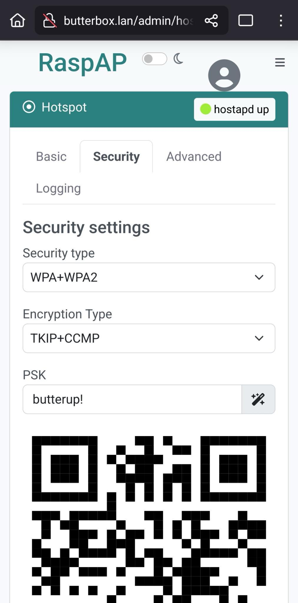

# Добавить пароль Wi-Fi

Изменение пароля Wi-Fi для точки доступа вашего Butter Box через панель администратора — это просто. Вот шаги:

#### Доступ к веб-интерфейсу RaspAP

Откройте веб-браузер на устройстве, подключённом к вашему Butter Box, и введите [http://butterbox.lan/admin](http://butterbox.lan/admin)

---

#### Вход в систему

Учётные данные по умолчанию: Имя пользователя: `admin` | Пароль: `secret` (Настоятельно рекомендуется изменить эти учётные данные администратора по умолчанию после первоначальной настройки для обеспечения безопасности).

---

#### Перейдите к настройкам точки доступа

В боковом меню нажмите на «Hotspot».

---

#### Перейдите на вкладку «Безопасность»

В разделе Hotspot найдите вкладку «Security».

---

#### Измените текущие настройки

На вкладке Security,

* Измените «Security Type» на «WAP+WAP2»
* Измените «Encryption Type» на «TKIP+CCMP»
* В поле «PSK» (Pre-Shared Key) введите желаемый новый пароль Wi-Fi

Или, если хотите, «значок волшебной палочки» рядом с ним может сгенерировать надёжный пароль для вас. Примечание: этот пароль представляет собой комбинацию случайных цифр и букв; если вы выберете этот вариант, обязательно сохраните его в безопасном месте.

---

#### Сохраните и перезапустите точку доступа

После ввода нового пароля прокрутите вниз и нажмите кнопку «Save settings».

Затем вам нужно будет нажать «Restart hotspot», чтобы изменения вступили в силу. Это временно отключит все устройства от Butter Box во время перенастройки.

---

После перезапуска точки доступа вам и вашим друзьям нужно будет снова подключиться к Butter Box, используя новый пароль Wi-Fi, который вы только что установили.

## Дополнительная безопасность

Для получения дополнительной информации о защите вашего Butter Box посетите [https://gitlab.com/likebutter/butterbox-rpi/-/blob/main/docs/en/README.md#securing-your-butter-box](https://gitlab.com/likebutter/butterbox-rpi/-/blob/main/docs/en/README.md#securing-your-butter-box)

