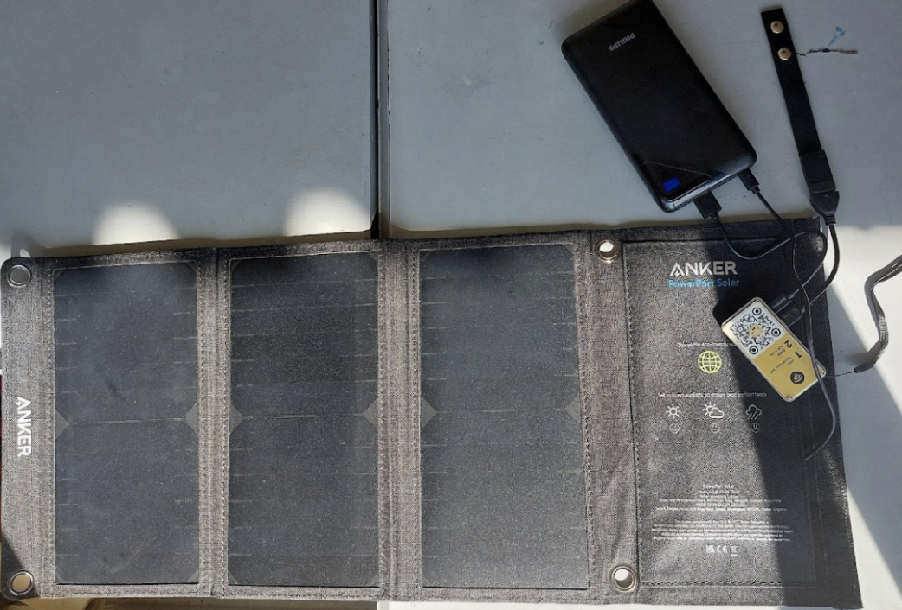

# Источник питания

Если вы хотите, чтобы Butter Box работал полностью автономно и без электричества — это возможно! 
Butter Box может работать от розетки, от предварительно заряженного аккумулятора или от аккумулятора с солнечной панелью.

* **Розетка:** Официальный и рекомендуемый блок питания для компьютеров Raspberry Pi (зависит от используемой модели Raspberry Pi)
* **Предварительно заряженный аккумулятор (Power Bank):** Это наиболее распространённый вариант для использования в полевых условиях.
  * Портативное зарядное устройство Anker [power bank](https://www.ozon.ru/product/zaryadnoe-ustroystvo-anker-nano-charger-45w-chernyy-a2692l11-3298658513/), 
  [power bank](https://aliexpress.ru/item/1005011864808436.html)
* **Солнечная панель (с Power Bank):** Используйте небольшую солнечную панель для подзарядки вашего power bank. Это хороший вариант для непрерывной работы устройства в местах без электросети. Использование солнечной панели напрямую без аккумулятора возможно, но нестабильно при переменной облачности.
  * Комплекты солнечных панелей: [https://voltaicsystems.com/solar-panel-kits/](https://voltaicsystems.com/solar-panel-kits/)

