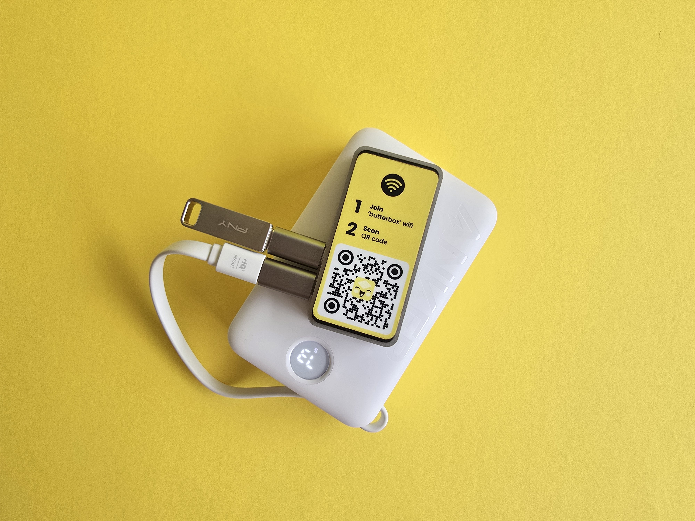
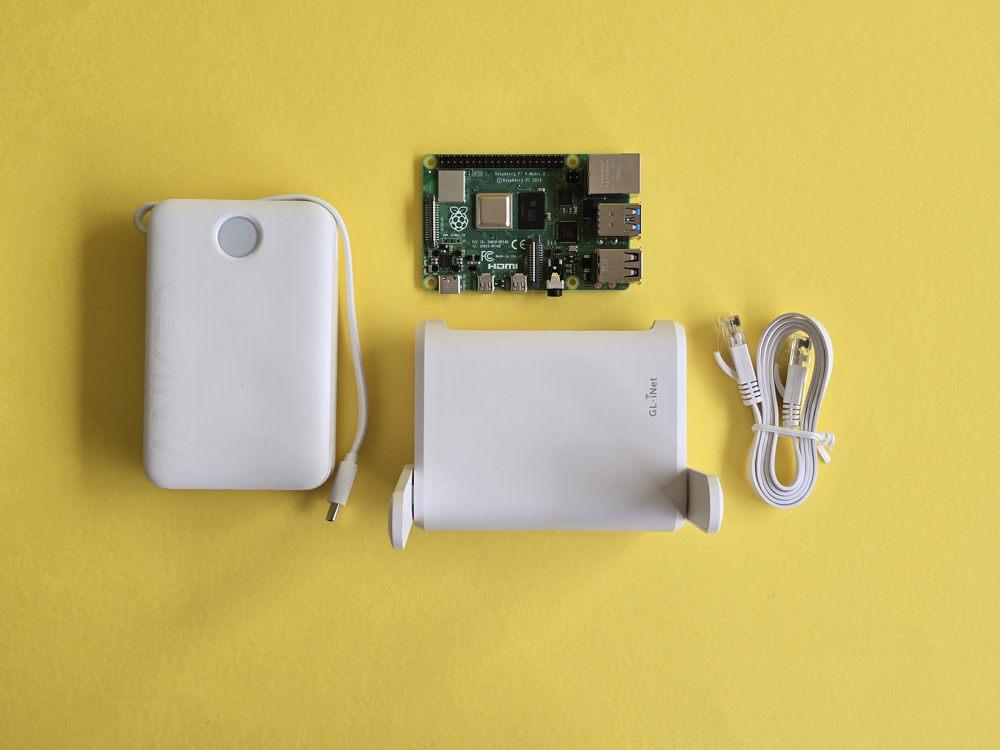

# Raspberry Pi

<figure><figcaption></figcaption></figure>

## Basic Box Supply List

* Raspberry Pi Zero 2W (64 Bit) [https://www.adafruit.com/product/5291](https://www.adafruit.com/product/5291); Or you can buy a kit here: [\
  https://www.canakit.com/raspberry-pi-zero-2-w.html](https://www.canakit.com/raspberry-pi-zero-2-w.html)
* Power Cord that accompanies the Raspberry Pi Zero 2W
* Micro SD Card: Images are usually under 16 GB (we suggest 256 GB). Media that people upload to the chat ends up on the card; it never gets cleared.&#x20;
* USB drive (min 32 GB)
* Adapters:
  * Micro USB/Male to USB A/Female
  * A dongle to connect the micro SD card to your laptop (if needed)

<figure><figcaption></figcaption></figure>

## Extended Box Supply List

* ..
* ..

## Power Supply Options

If you want Butter to work completely off-grid and without electriciy,  it can!

