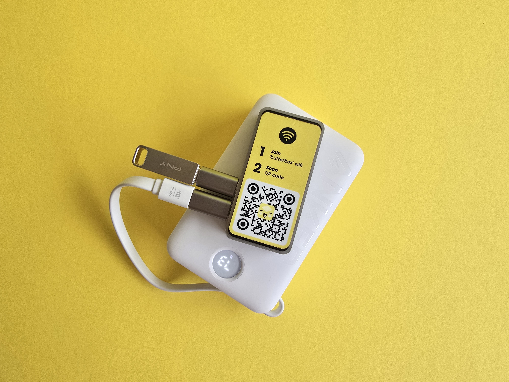

# Комплектующие для базовой коробки

Базовая конфигурация Butter Box — это Raspberry Pi Zero 2 W с картой microSD, на которой установлено программное обеспечение Butter, USB-накопитель и питание от USB-источника, такого как кабель питания, power bank или солнечная панель.

В большинстве таких конфигураций Butter Box может комфортно обслуживать **от 4 до 10 подключённых устройств одновременно** без замедления. Возможно подключить и больше, но производительность может снизиться, если все одновременно загружают большие файлы или видео.

Радиус действия составляет около **5–10 метров** в помещении, в зависимости от модели Raspberry Pi, а также от стен и помех. На открытом воздухе, на открытом пространстве, он иногда может быть больше. Представьте себе радиус действия домашнего Wi-Fi роутера — достаточно, чтобы покрыть класс, кафе, переговорную комнату или небольшое мероприятие на открытом воздухе.

## Комплектующие

* [ ] Raspberry Pi Zero 2W (64 Bit) [https://www.adafruit.com/product/5291](https://www.adafruit.com/product/5291); Или вы можете купить комплект здесь: [\
  https://www.canakit.com/raspberry-pi-zero-2-w.html](https://www.canakit.com/raspberry-pi-zero-2-w.html)
* [ ] Розетка и кабель питания, входящие в комплект Raspberry Pi Zero 2W, или [альтернативный источник питания](../power-supply.md)
* [ ] Карта Micro SD: Образы с программным обеспечением Butter обычно занимают менее 16 ГБ (мы рекомендуем 256 ГБ). Медиафайлы, которые люди загружают в чат, сохраняются на карте; они никогда не удаляются.&#x20;
* [ ] USB-накопитель (минимум 32 ГБ)
*   [ ] Адаптеры (по необходимости)

    * [ ] Micro USB/штекер на USB A/гнездо
    * [ ] Переходник для подключения карты micro SD к вашему ноутбуку (если необходимо)

**Когда у вас будут все комплектующие, переходите к разделу «Установка Butter».**


[install-butter.md](install-butter.md)


<figure><figcaption></figcaption></figure>

