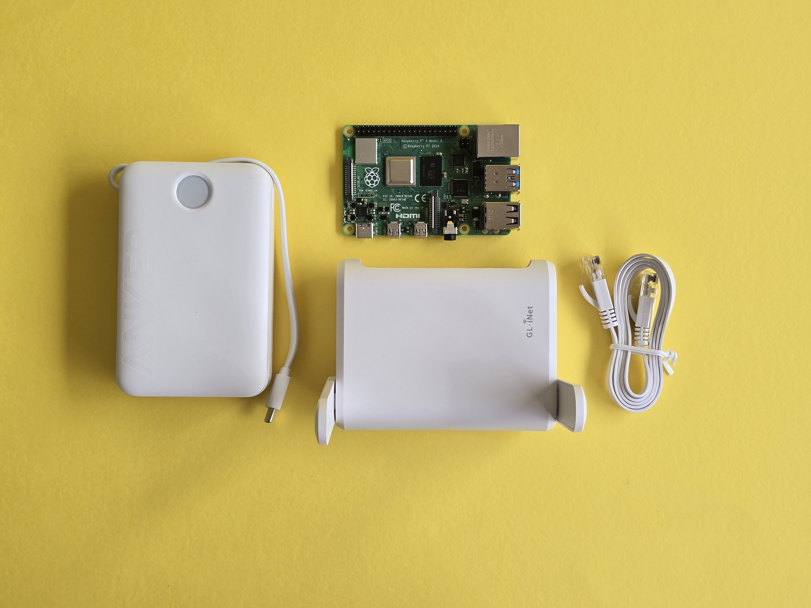

# Расширение вашей коробки

Расширенная Butter Box объединяет Raspberry Pi с отдельным Wi-Fi маршрутизатором, обеспечивая более сильный сигнал и большее количество одновременных подключений.&#x20;

С маршрутизатором сеть может охватывать 10-30 м (32-98 футов) и комфортно поддерживать 10–20 подключённых устройств одновременно. Эта конфигурация идеально подходит для средней группы людей в помещении среднего размера, например, в учебных классах, на мероприятиях или в общественных пространствах.

## Необходимые материалы

* [ ] Raspberry Pi 4, 5 или Raspberry Pi Zero 2W
* [ ] Маршрутизатор ([Opal (GL-SFT1200) Wireless Travel Router](https://store-us.gl-inet.com/products/united-states-opal-gl-sft1200-gigabit-wireless-router-dual-band-openwrt-ipv6-tor) или аналог)
* [ ] Розетка питания и кабели питания для Raspberry Pi и маршрутизатора или [альтернативный источник питания](../power-supply.md)
* [ ] Карта Micro SD: образы с программным обеспечением Butter обычно занимают менее 16 ГБ (мы рекомендуем 256 ГБ). Медиафайлы, которые пользователи загружают в чат, сохраняются на карте и никогда не удаляются.
* [ ] USB-накопитель (минимум 32 ГБ)
* [ ] Адаптеры (при необходимости)

_Подключение к интернету не требуется._

<figure><figcaption></figcaption></figure>

## Шаги

Чтобы расширить вашу коробку, просто подключите маршрутизатор GLi-Net к Butter Box с помощью кабеля Ethernet. Вместо доступа к коробке через портальную точку доступа Wi-Fi (например, ‘butter box’ или любое имя, которое вы задали в настройках администратора), пользователи будут подключаться к сети Wi-Fi маршрутизатора.&#x20;



### Подключите Butter Box к источнику питания.&#x20;

Подключите Butter Box к питанию.



### Подключите маршрутизатор

Подключите маршрутизатор к питанию. Затем используйте кабель Ethernet для подключения к Butter Box. Убедитесь, что кабель Ethernet подключён к порту LAN на вашем маршрутизаторе.&#x20;



### Проверьте подключение

Подключитесь к Wi-Fi маршрутизатора. Если вы ещё не настраивали и не использовали этот маршрутизатор, введите пароль по умолчанию, указанный в руководстве пользователя, входящем в комплект. Через 30 секунд откройте http://butterbox.local в браузере.



### Отключите точку доступа Wi-Fi Butter Box

Откройте настройки администратора на портале Butter Box. Перейдите в раздел **Безопасный портал**. Отключите точку доступа Wi-Fi. Это скроет сеть Wi-Fi, транслируемую Raspberry Pi, чтобы пользователи не путались, к какой сети подключаться.



### Пригласите пользователей подключиться к Wi-Fi маршрутизатора

Теперь пользователи будут подключаться к сети Wi-Fi маршрутизатора, когда захотят подключиться к Butter Box.


