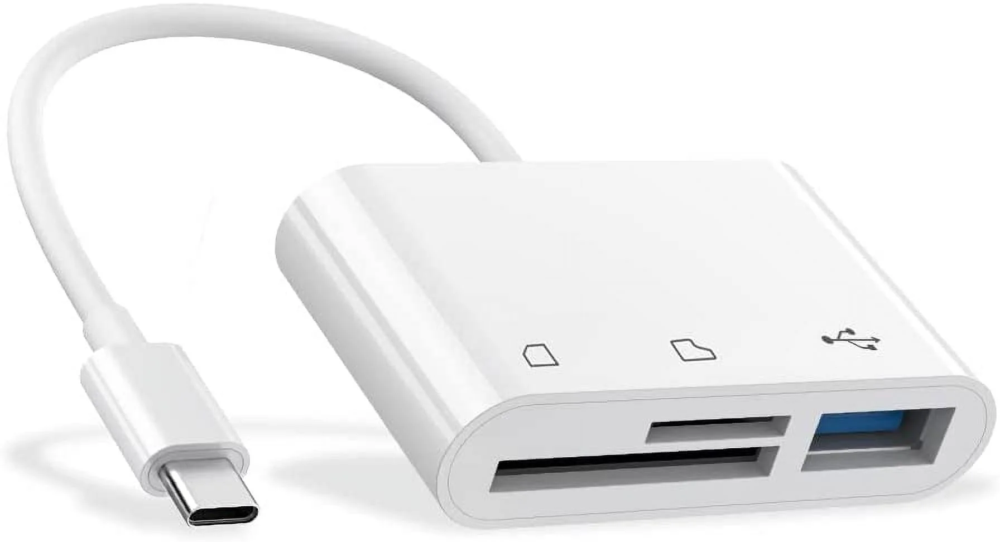

# Установка Butter

Вам понадобится:

* Настольный компьютер
* Подключение к интернету
* Butter Box

### Скачайте Butter OS для Raspberry Pi

Убедитесь, что размер файла совпадает с размером, указанным на сайте. Иногда браузеры не завершают загрузку, что может привести к повреждению файла.

[https://www.dropbox.com/scl/fo/helpqh3q2oj7ti2ia038m/h?dl=0.&rlkey=cswt4w4zksiuj3eb1oca48yw0](https://www.dropbox.com/scl/fo/helpqh3q2oj7ti2ia038m/h?dl=0.&rlkey=cswt4w4zksiuj3eb1oca48yw0)

> **Информация:**
> Всегда выбирайте последнюю версию файла.

---

### Вставьте карту micro SD в компьютер

Чтобы вставить карту micro SD в компьютер, вам может понадобиться адаптер:

> **Информация:**
> Подключать коробку к компьютеру не нужно.

---

### Запустите Raspberry Pi Imager

После того как вы вставили карту micro SD в компьютер с подключением к интернету, запустите Raspberry Pi Imager на настольном компьютере. Программа проведёт вас через шаги установки операционной системы Butter на карту micro SD.

Если у вас нет Raspberry Pi Imager, вы можете скачать его здесь: [https://www.raspberrypi.com/software/](https://www.raspberrypi.com/software/)

---

### Выберите устройство > **Raspberry Pi Zero 2 W**

После запуска Raspberry Pi Imager вам будет предложено выбрать устройство Raspberry Pi.

<figure><figcaption>
Выберите Raspberry Pi Zero 2 W (или другое устройство, если у вас не стандартная коробка от Butter HQ)
</figcaption></figure>
---

### Выберите операционную систему > Use Custom

* На вкладке ОС выберите **Use Custom** и загрузите файл butter-******.img  Убедитесь, что вы **распаковали файл xz** перед использованием.

<figure><figcaption>
Выберите «Use Custom». Выберите файл .img, который скачали с Dropbox.
</figcaption></figure>

---

### Выберите хранилище > Выберите карту Micro SD

* На вкладке **Хранилище** выберите **карту Micro SD.**

<figure><figcaption>
Выберите карту Micro SD.
</figcaption></figure>

После того как вы всё выбрали, ваш экран будет выглядеть примерно так:

<figure><figcaption>
Финальный экран после выбора.
</figcaption></figure>

Вам может быть показано сообщение _«Doing this will erase all data from selected external storage»_ и _«do you want to apply settings?»_, нажмите _«no, clear settings»_.

После этого выберите _«write»_ и начните процесс записи на карту Micro SD.

---

### Извлеките из компьютера и вставьте карту Micro SD в Raspberry Pi (Butter Box)

По завершении извлеките карту Micro SD. Вставьте карту Micro SD в Raspberry Pi (Butter Box), который не подключён к питанию.

---

### Перейдите к быстрому старту

Подключите Raspberry Pi (Butter Box) к питанию. Подождите несколько мгновений и подключитесь к порталу Butter Box. Перейдите в раздел [Быстрый старт](../../quick-start.md) для получения дополнительной информации.

---

**Если вы собираете улучшенный Butter Box (с увеличенным радиусом действия), перейдите к следующему разделу: Апгрейд Butter Box.**

[extend-your-box.md](extend-your-box.md)

### Устранение неполадок

Если вы видите ошибку, указывающую, что входной файл не является допустимым образом диска, проверьте скачанный файл.

Убедитесь, что размер файла совпадает с размером, указанным на сайте. Иногда браузеры не завершают загрузку, что может привести к повреждению файла.

Также убедитесь, что вы **распаковали файл** перед использованием.

<figure><figcaption></figcaption></figure>

