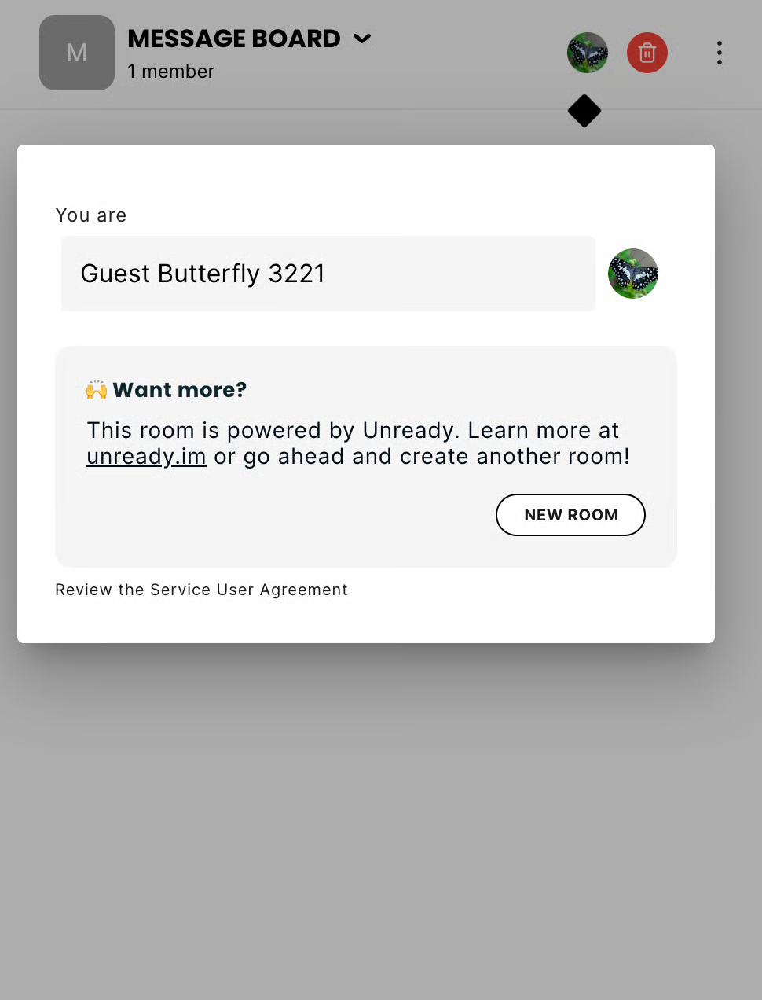

# Установка Butter

Вам понадобится:

* Настольный компьютер
* Подключение к интернету
* Butter Box



### Скачайте Butter OS для Raspberry Pi&#x20;

Убедитесь, что размер файла совпадает с размером, указанным на сайте. Иногда браузеры не завершают загрузку, что может привести к повреждению файла.




Всегда выбирайте последнюю версию файла.&#x20;




### Вставьте карту micro SD в компьютер

Чтобы вставить карту micro SD в компьютер, вам может понадобиться адаптер:

<figure><figcaption>
Пример адаптера (USB-C к Micro SD)
</figcaption></figure>


Подключать коробку к компьютеру не нужно.




### Запустите Raspberry Pi Imager&#x20;

После того как вы вставили карту micro SD в компьютер с подключением к интернету, запустите Raspberry Pi Imager на настольном компьютере. Программа проведёт вас через шаги установки операционной системы Butter на карту micro SD.&#x20;

Если у вас нет Raspberry Pi Imager, вы можете скачать его здесь: [https://www.raspberrypi.com/software/](https://www.raspberrypi.com/software/)



### Выберите устройство > **Raspberry Pi Zero 2 W**

После запуска Raspberry Pi Imager вам будет предложено выбрать устройство Raspberry Pi.

<figure><figcaption>
Выберите Raspberry Pi Zero 2 W (или другое устройство, если у вас не стандартная коробка от Butter HQ)
</figcaption></figure>



### Выберите операционную систему > Использовать пользовательскую

* На вкладке ОС выберите **Использовать пользовательскую** и загрузите пользовательский файл Butter OS .img. Убедитесь, что вы **распаковали файл** перед использованием.&#x20;

<figure><figcaption>
Выберите «Использовать пользовательскую». Вы загрузите пользовательский файл .img, который скачали с Dropbox.
</figcaption></figure>



### Выберите хранилище > Выберите карту Micro SD

* На вкладке **Хранилище** выберите **карту Micro SD.**

<figure><figcaption>
Выберите карту Micro SD.
</figcaption></figure>

После всех выборов ваш экран будет выглядеть примерно так:

<figure><figcaption>
Финальный экран после выбора.
</figcaption></figure>

Вам может быть показано сообщение _«Это действие удалит все данные с выбранного внешнего хранилища»_ и _«Хотите ли вы применить настройки»_, нажмите _«нет, очистить настройки»_.

После этого выберите _«записать»_ и начните процесс записи на карту Micro SD.



### Извлеките из компьютера и вставьте карту Micro SD в Raspberry Pi (Butter Box)

По завершении извлеките карту Micro SD. Вставьте карту Micro SD в Raspberry Pi (Butter Box), который не подключён к питанию.&#x20;



### Перейдите к быстрому старту

Подключите Raspberry Pi (Butter Box) к питанию. Подождите несколько мгновений и подключитесь к порталу Butter Box. Перейдите в раздел [Быстрый старт](../../quick-start.md) для получения дополнительной информации.



**Если вы собираете расширенную коробку, перейдите к следующему разделу: Расширение вашей коробки.**


[extend-your-box.md](extend-your-box.md)


### Устранение неполадок

Если вы видите ошибку, указывающую, что входной файл не является допустимым образом диска, проверьте скачанный файл.

Убедитесь, что размер файла совпадает с размером, указанным на сайте. Иногда браузеры не завершают загрузку, что может привести к повреждению файла.

Также убедитесь, что вы **распаковали файл** перед использованием.

<figure><figcaption></figcaption></figure>
