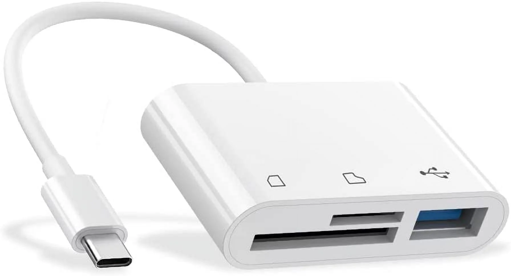

# Install Butter

You will need:

* Desktop computer
* Internet Connection
* Butter Box



### Download the Butter OS for Raspberry Pi&#x20;




Always choose the Latest Version of the file




### Plug the micro SD card into your computer

To plug the micro SD card into your computer, you may need an adapter to do this:

<figure><figcaption>
Example adapter (USB-C to Micro SD)
</figcaption></figure>


You don't need to connect the box to the computer.




### Run Raspberry Pi Imager&#x20;

Once you have your micro SD card plugged into your computer that has an internet connection, run Raspberry Pi Imager from a desktop computer. It will walk you through the steps to install the Butter operating system on the micro SD card.&#x20;

If you don't have Raspberry Pi Imager, you can download it here: [https://www.raspberrypi.com/software/](https://www.raspberrypi.com/software/)



### Choose device > **Raspberry Pi Zero 2 W**

Once the Raspberry Pi Image starts, you will be prompt with the screens below.&#x20;

* Click on **Choose Device**

<figure><figcaption>
Select Choose device
</figcaption></figure>

* Select **Raspberry Pi Zero 2 W**\
  If you have a different Raspberry Pi device than the standard recommendation for a Butter Box, choose it instead.

<figure><figcaption>
Select Raspberry Pi Zero 2 W (or the device you have if it's not the standard box from Butter HQ)
</figcaption></figure>



### Choose Operating System > Use Custom

* Click on **Choose OS** back in the main view
* Select **Use custom** and upload the custom .img file that you've downloaded from Dropbox

<figure><figcaption>
Select Use Custom. You will upload the custom .img file that you downloaded from Dropbox.
</figcaption></figure>



### Choose Storage > Select Micro SD Card

* Click on **Choose Storage** back in the main view
* Select the **Micro SD Card**

<figure><figcaption>
Select the Micro SD Card.
</figcaption></figure>

Your screen will look similar to this after all selections:

<figure><figcaption>
Final screen after selections.
</figcaption></figure>

You may be prompt with _"Doing this will erase all data from selected external storage"_ and “_do you want to apply settings”_, click then on _“no clear settings”_.

After that select _"write"_ and begin writing process to the Micro SD card.



### Remove From Computer and Insert Micro SD Card into the Raspberry Pi (Butter Box)

Once you're done, remove the Micro SD card. Insert the Micro SD card into the Raspberry Pi (Butter Box) not powered on. Plug the Raspberry Pi (Butter Box) into power. Wait a few moments and connect to the Butter Box Portal.


