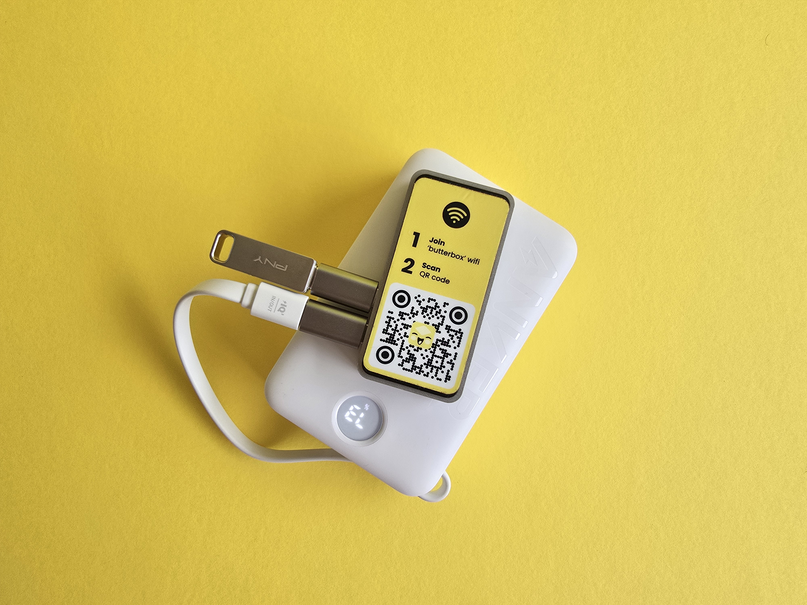
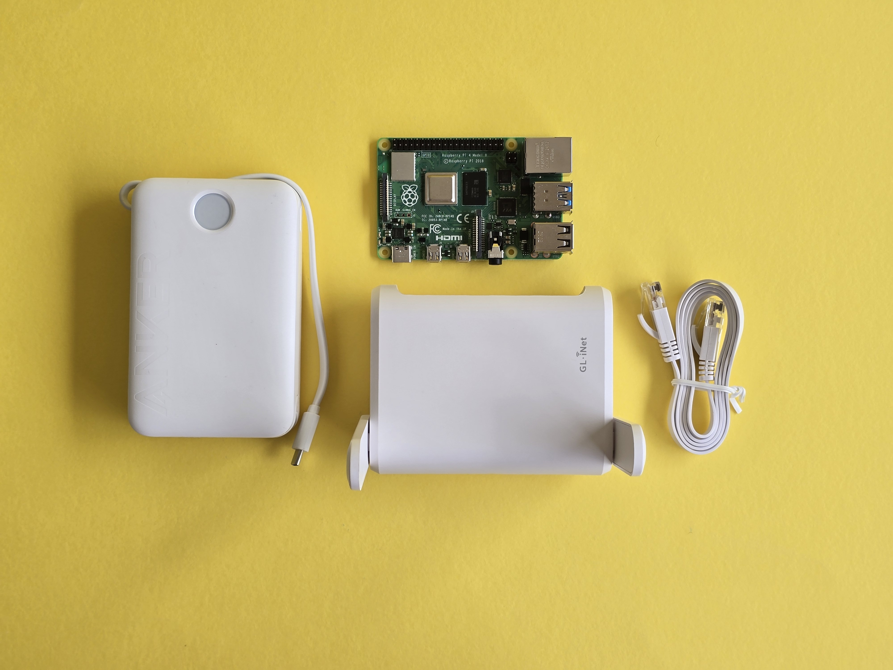

# Setup and Supplies

This section covers the setup and supplies required to build your own box with the Raspberry Pi hardware. You have 2 options:

1. [Basic Box](setup-and-supplies.md#basic-box-supply-list) (Up to 10 people, About 10 meters apart)
2. [Extended Box](setup-and-supplies.md#extended-box-supply-list) (Up to 20 people, About 30 meters apart)

<figure><figcaption></figcaption></figure>

## Basic Box&#x20;

**Supply List**

* Raspberry Pi Zero 2W (64 Bit) [https://www.adafruit.com/product/5291](https://www.adafruit.com/product/5291); Or you can buy a kit here: [\
  https://www.canakit.com/raspberry-pi-zero-2-w.html](https://www.canakit.com/raspberry-pi-zero-2-w.html)
* Power Cord that accompanies the Raspberry Pi Zero 2W or an [alternative power supply](../power-supply.md)
* Micro SD Card: Images are usually under 16 GB (we suggest 256 GB). Media that people upload to the chat ends up on the card; it never gets cleared.&#x20;
* USB drive (min 32 GB)
* Adapters:
  * Micro USB/Male to USB A/Female
  * A dongle to connect the micro SD card to your laptop (if needed)

**About**

A basic Butter Box setup is a Raspberry Pi Zero 2 W with a microSD card running the Butter software, a USB stick, powered by a USB source like a power cord, power bank or solar panel.

In most setups like this, a Butter Box can comfortably handle **4–10 connected devices at once** without slowing down. It’s possible to have more, but performance may drop if everyone is downloading large files or videos at the same time.

The reach for it is about **5–10 meters** indoors, depending on the Raspberry Pi model and depending on walls and interference. Outdoors, in open space, it can sometimes reach farther. Think of it like the range of a home Wi-Fi router — enough to cover a classroom, a coffee shop, meeting space, or small outdoor gathering.

<figure><figcaption></figcaption></figure>

## Extended Box

**Supply Lisst**

* Raspberry Pi 4&#x20;
* Power Cord that accompanies the Raspberry Pi 4 or an [alternative power supply](../power-supply.md)
* Router
* Micro SD Card
* USB drive (min 32 GB)
* Adapters (as needed)

**About**

An extended Butter Box pairs the Raspberry Pi with a standalone Wi-Fi router, giving stronger signal and more simultaneous connections. For this option, you’ll want a Raspberry Pi model that has an ethernet port, this means a **Raspberry Pi 4** or a **Raspberry Pi 5**.

With the router, the network can reach **10-30 m**, like a city block or a park, and can comfortably support **10–20 connected devices** at the same time per router (but you can add more routers to it).

This setup is ideal for medium group of people in a medium room, like classrooms, events, or community spaces like a church.

For instructions, go to the [Extend Your Box](extend-your-box.md) section.

