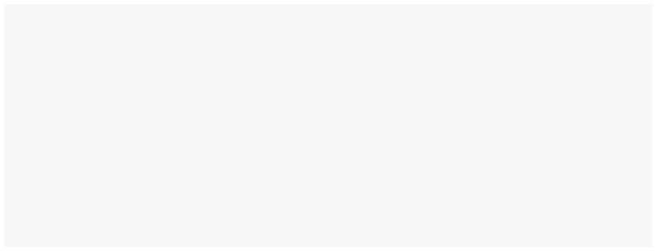

# Content Packs

You can create your own content pack! It simply needs to be set up as a **static website with local links**. This website will run from the box itself, so all of the images and files required for the website need to be contained within one main folder.&#x20;

Once you have your static website ready, you will put all of the required files for it in one folder, and place this folder in the **main (root) directory** of your USB drive. This website will be rendered in the browser people use to access the Butter Box portal.&#x20;

Tips for creating a content pack with a static website:

* **Contents.** Everything for the static website must be stored on a USB drive that plugs into the Butter Box. It should not link to resources on the global internet.&#x20;
* **Size.** The size of your content pack is limited by the amount of space available on your USB drive. Though, keep in mind that if multiple people are downloading or watching really large files from the box, there may be some latency.
* **Pages.** Links between pages should point to other saved pages in the same folder, not to the internet. You must use relative paths (e.g. about/index.html) instead of absolute web URLs.
* **Media.** Pictures, videos, and sounds cannot be linked to from somewhere online. The files need to be in your website folder and stored on the USB drive.
* **Libraries.** The website cannot use javascript libraries that rely on an internet connection.&#x20;
* **Styles.** Special fonts and icons (like those from Google Fonts) also need to be packed into the folder, not fetched from the web.

### Try It

* The zip file below contains a sample static website. To get a feel for how static websites work with butter—Download it. Unzip it. Then, add this set of files to your USB drive.



### Get Started

The best way to get started with creating your own content pack is to have an idea about the experience and type of information you want to provide, and then to design and build a local static website for it.

It can be very simple like an audio player for music. Or, a simple list of the five top VPN apps that you recommend. Or it can be more complex like a library or knowledge base of cultural artifacts.&#x20;

<figure><figcaption></figcaption></figure>



### Add website files to a USB drive

Place a folder with your website files in the **root directory** of a USB drive. Be sure that your website folder contains your **index.html.** The name of this folder will be displayed on the Butter Box portal.&#x20;

<figure><figcaption>
USB directory when viewed in Finder on desktop
</figcaption></figure>



### Connect to your Butter Box to view

Insert the USB drive into your Butter Box. When you open the Butter Box portal, tap **Files**. Navigate to the website folder. Tap to view.

<figure><figcaption></figcaption></figure>



In this section, we will give instructions for curating a maps and apps content pack. If you configure the folders for these in a special way, a tile will appear on the portal.&#x20;

[maps.md](maps.md "mention")

[apps.md](apps.md "mention") 
