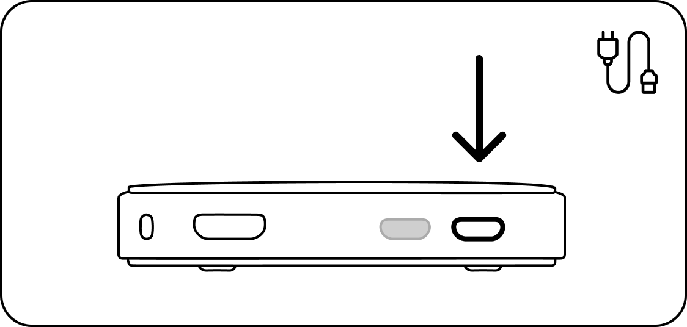

# How to Setup / Power On!

If you have a pre-built Butter Box, here's how to get it set up!



### Plug it in to power on

Connect the power supply to the first micro USB port and correct wall outlet.

<figure><figcaption></figcaption></figure>

_If using a solar battery or other means of power, use one with the correct specs to ensure adequate power and avoid damage to the unit. For a Pi Zero 2 W use Micro USB power supply with at least 2.0A._



### Join the Wi-Fi

Connect the USB adapter to the open port. Then plug in the USB drive.

<figure><figcaption></figcaption></figure>

You will know the box is working if ‘butterbox’ Wi-Fi appears in the Wi-Fi list. If it doesn’t, unplug the box and plug it back in.

_<mark style="color:$info;">\*Disclaimer...</mark>_



### Access the Butter Box (For You and Others)

Join the ‘butterbox’ Wi-Fi. After 30 seconds, scan the QR code on the box. This connects you to http://butterbox.lan in a browser.

<figure><figcaption></figcaption></figure>

_If this page does not load, wait a few minutes to ensure connectivity. Refresh the page. If you’re connecting from a smartphone, turn off your mobile data or turn on airplane mode. Then try again._

_<mark style="color:$info;">\*Disclaimer</mark>_



### Once connected, see what it can do!

**A. It can distribute Android apps!** The Box can distribute apps from the browser or from the Butter app.

**B. It can spread information!** The Box can spread information via a public chat room to anyone who connects to the portal.

**C. It can distribute content from a USB drive!** If you have a USB drive connected with content, those contents will be displayed in the portal.

<figure><figcaption></figcaption></figure>

Learn more how to customize your ButterBox here




For a Pi Zero 2 W: Up to 5 people can connect to the box at any time. After people connect and get what they need, encourage them to leave the box to give others a turn.\
The physical reach of the Box varies. But as a rule of thumb, people in the same room as the box (or in talking distance) will be able to access it.

