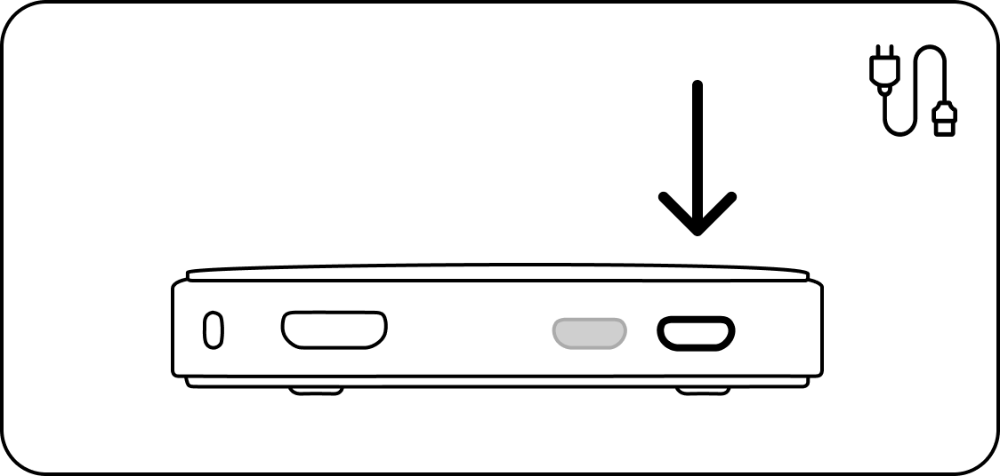
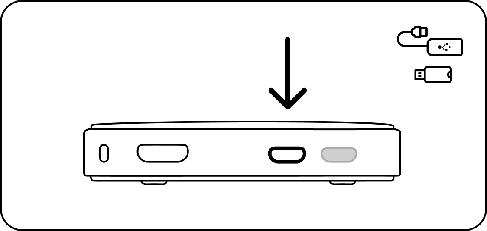

# Quick Start

If you have a Butter Box with the latest version of the Butter software loaded on the SD card, take these quick steps to get set up.

1.  Make sure you have the basic required supplies:&#x20;

    1. Butter Box  (with SD card inserted)
    2. Power cord&#x20;
    3. USB drive and necessary micro USB adapter

    <figure><figcaption></figcaption></figure>

2.  Download the [USB drive sample](https://drive.google.com/file/d/1pQL0v-cHRjrytPi6BlK5bB4-r_eEarTV/view?usp=sharing) and move it to your USB drive. (Note: You will need a computer to do this)

    <figure><figcaption>
Preview of the folder setup on the USB Drive Sample
</figcaption></figure>

3. Plug the USB drive into the Butter Box
4. Power on. Insert the power cord into the Butter Box. Then plug the other end into the wall. Wait a moment while your Butter Box powers on.
5. Join your own Butter Box local hotspot. [https://app.gitbook.com/o/pz2iEcORvBFM3sIsAXBf/s/uTGFiT4NJYmIEtmMvMTL/\~/changes/42/get-started/how-to-setup](get-started/how-to-setup-power-on.md)


[how-to-setup-power-on.md](get-started/how-to-setup-power-on.md)


For more in-depth details on how to power up your own Butter Box, go to the [Get Started](get-started/) section.

If you have a pre-built Butter Box, here's how to get it set up!



### Plug it in to power on

Connect the power supply to the first micro USB port and correct wall outlet.

<figure><figcaption></figcaption></figure>

You will know the box is working if ‘butterbox’ wifi appears in the wifi list. If it doesn’t, unplug the box and plug it back in.

_If using a solar battery or other means of power, use one with the correct specs to ensure adequate power and avoid damage to the unit. For a Pi Zero 2 W use Micro USB power supply with at least 2.0A._



### Insert USB drive

Connect the USB adapter to the open port. Then plug in the USB drive.

<figure><figcaption></figcaption></figure>



### Access the Butter Box (For You and Others)

Join the ‘butterbox’ Wi-Fi. After 30 seconds, scan the QR code on the box. This connects you to http://butterbox.lan in a browser.

<figure><figcaption></figcaption></figure>

_If this page does not load, wait a few minutes to ensure connectivity. Refresh the page. If you’re connecting from a smartphone, turn off your mobile data or turn on airplane mode. Then try again._



### Once connected, explore the portal!


