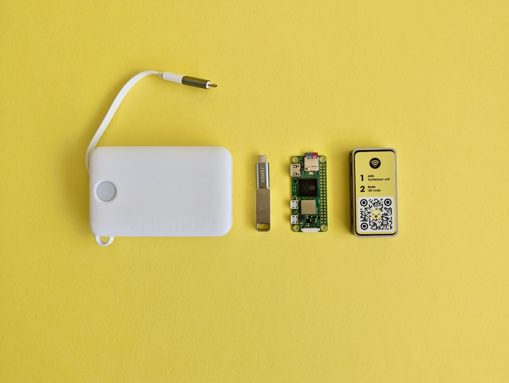
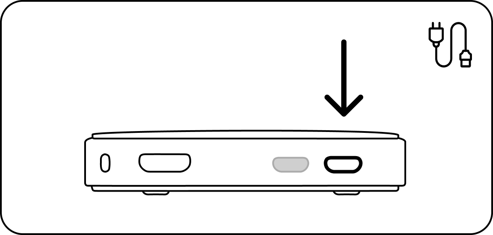
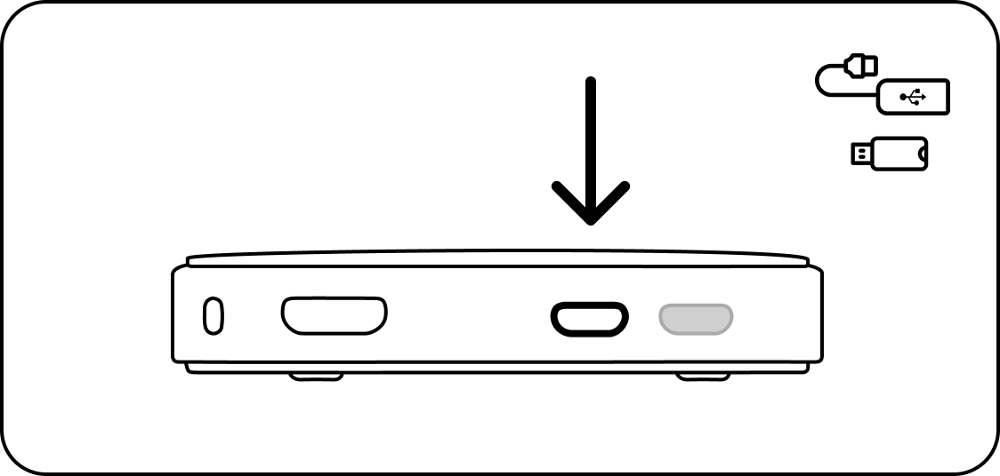
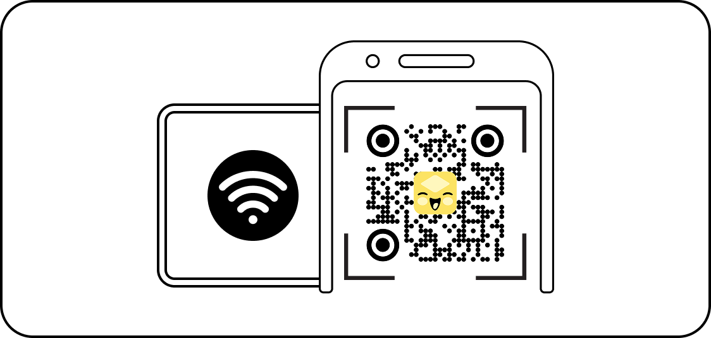

# Быстрый старт

Если у вас есть Butter Box с последней версией программного обеспечения Butter, загруженной на SD-карту, выполните эти быстрые шаги для настройки.

### Проверьте комплектующие

Убедитесь, что у вас есть всё необходимое для базового Butter Box:

* [ ] Источник питания с кабелем
* [ ] USB-накопитель
* [ ] USB-адаптеры (при необходимости)
* [ ] Устройство Butter Box (с вставленной micro SD-картой)
* [ ] Корпус

---

### Убедитесь, что micro SD-карта вставлена в устройство

На micro SD-карте должна быть записана последняя версия Butter OS.

---

### Подключите к питанию для включения

Подключите блок питания к первому порту micro USB и к розетке.

Вы узнаете, что Box работает, если Wi-Fi 'butterbox' появится в списке Wi-Fi на вашем телефоне или компьютере. Если он не появляется, отключите Box и подключите его снова.

_Если вы используете солнечную батарею или другой источник питания, используйте устройство с правильными характеристиками, чтобы обеспечить достаточную мощность и избежать повреждения устройства. Для Pi Zero 2 W используйте блок питания Micro USB мощностью не менее 2.0A._

[Ссылка на варианты блоков питания](build-a-box/power-supply.md)

---

### Вставьте USB-накопитель

Подключите USB-адаптер к свободному порту. Затем подключите USB-накопитель. Узнайте больше о загрузке контента на USB-накопитель в разделе [Обмен файлами](services/file-sharing.md).

---

### Доступ к порталу Butter Box

Подключитесь к Wi-Fi 'butterbox'. Через 30 секунд отсканируйте QR-код на Box. Это подключит вас к **http://butterbox.local** в браузере.

[https://youtu.be/KB5O9MSoaAg](https://youtu.be/KB5O9MSoaAg)

_Если эта страница не загружается, подождите несколько минут для установления соединения. Обновите страницу. Если вы подключаетесь со смартфона, отключите мобильные данные или включите режим полёта. Затем попробуйте снова._

> **Информация:**
> Это HTTP-страница, а не HTTPS, потому что она обслуживается локальным устройством без подключения к интернету. Ваши данные никогда не покидают сеть, поэтому они по-прежнему конфиденциальны и безопасны.

Wi-Fi по умолчанию не имеет пароля. Однако вы можете легко добавить его в настройках администратора.

---

### После подключения используйте «настройки администратора» для настройки вашего Butter Box.

Мастер настройки администратора предназначен для того, чтобы предоставить вам выбор, какие сервисы предлагаются на Butter Box, и чтобы повысить его безопасность. Вам будет предложено перейти в «настройки администратора», если вы используете Box впервые.

---

### Поделитесь доступом к порталу

Когда вы поделитесь доступом с другими, они подключатся к нему так же, как это сделали вы.

---

> **Информация:**
> Для Pi Zero 2 W: к Box одновременно могут подключиться до 5 человек. После того как люди подключатся и получат то, что им нужно, попросите их отключиться, чтобы дать возможность другим.\
> Физическая зона действия Box варьируется. Но как правило, люди, находящиеся в одном помещении с Box (или на расстоянии слышимости), смогут получить к нему доступ.
