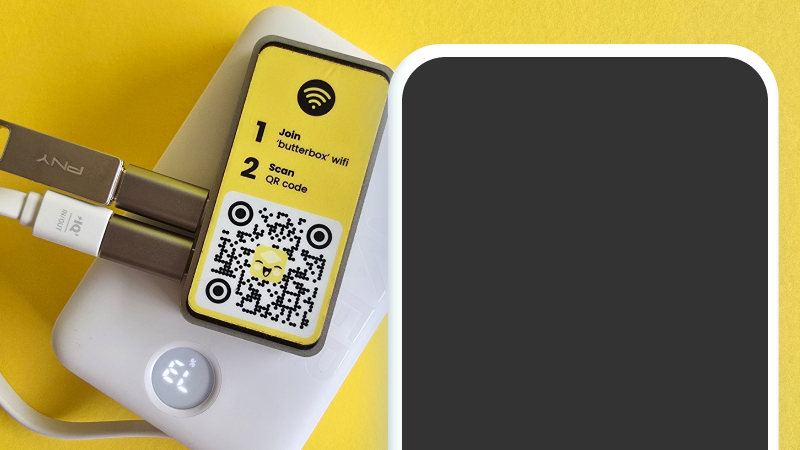

# Quick Start

[Back to Get Started](../)

If you have a Butter Box with the latest version of the Butter software loaded on the SD card, take these quick steps to get set up.



### Plug it in to power on

Connect the power supply to the first micro USB port and correct wall outlet.

<figure><figcaption></figcaption></figure>

You will know the box is working if ‘butterbox’ wifi appears in the wifi list. If it doesn’t, unplug the box and plug it back in.

_If using a solar battery or other means of power, use one with the correct specs to ensure adequate power and avoid damage to the unit. For a Pi Zero 2 W use Micro USB power supply with at least 2.0A._



### Insert USB drive

Connect the USB adapter to the open port. Then plug in the USB drive. Learn more about loading the USB drive with treasures in the [Load USB](load-usb.md) section.

<figure><figcaption></figcaption></figure>



### Access the Butter Box Portal

Join the ‘butterbox’ Wi-Fi. After 30 seconds, scan the QR code on the box. This connects you to http://butterbox.lan in a browser.

<figure><figcaption></figcaption></figure>

_If this page does not load, wait a few minutes to ensure connectivity. Refresh the page. If you’re connecting from a smartphone, turn off your mobile data or turn on airplane mode. Then try again._

The Wi-Fi does not have a password by default. Though, you can easily add one. Learn more in the [Set Wi-Fi Password ](set-wifi-password.md)section.



### Once connected, explore the portal!



<figure><figcaption>
video of the connect to portal flow
</figcaption></figure>
