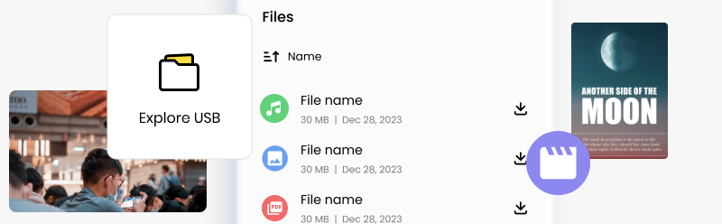

# Load USB

<figure><figcaption></figcaption></figure>

## Quickly Add Media, Files and Digital Books

You can use your Butter Box to share media, files, and digital books. When you connect to your Butter Box portal for the first time, the Message Board is shown by default. To display additional content in your portal, connect a USB drive containing the information you want to share.

If you’d like more control over how your content is displayed, you can build a **static HTML site** and share it through the Butter Box. Learn more in the [Content Packs](../customization/content-packs.md) section.



### Add files to your USB Drive

Place individual files directly in the **main directory** (root) of your USB drive. Or, create folders to organize your files (eg. "Books", "Music", "Reports)

<figure><figcaption>
USB directory when viewed in Finder on desktop
</figcaption></figure>



### Connect to your Butter Box to view

Insert the USB drive into your Butter Box. When you open the Butter Box portal, an **Explore USB** tile will be displayed.

<figure><figcaption></figcaption></figure>



### ℹ️ Things to Know

* The **folder names you use** on your USB drive will be shown in the Butter Box portal.
* Organizing content into folders makes it easier for others to browse and download.

## Share Even More—with Maps, Apps and Moderated Chat!

Learn more about how to share maps, apps and use static websites to feature content in the [Customization](../customization/) section.

