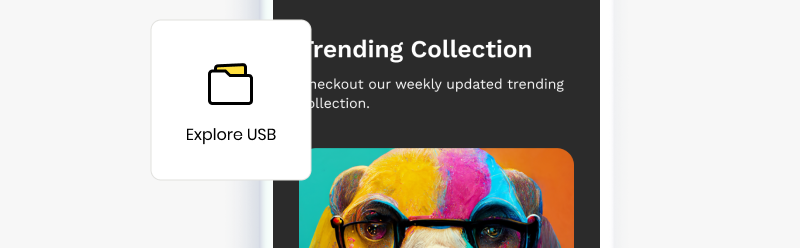
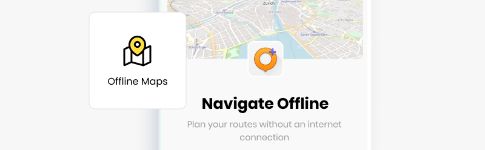
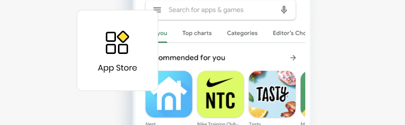

# Load USB

<figure><figcaption></figcaption></figure>

When you connect to your Butter Box portal for the first time, the Message Board is shown by default. To display additional content in your portal, connect a USB drive containing the files or content packs you want.

Depending on what content you’d like to add to your box and how you’d like it to appear, there are step-by-step instructions to guide you.

* [Media, Files and Digital Books](load-usb.md#media-files-and-digital-books)
* [Html Pages](load-usb.md#html-pages)
* [Maps](load-usb.md#maps)
* [Apps](load-usb.md#apps)

<figure><figcaption></figcaption></figure>

## Media, Files and Digital Books

If you want to share media, files or digital books, simply drop them onto the USB drive.&#x20;

**Things to Know**

* When you have the USB drive plugged in, the _Explore USB_ tile will show up in the portal.
* The `folder names` you use on your USB drive will be displayed in the Butter Box portal.

**Instructions**

* Drop individual files in the main directory of your USB drive or use a folder system to organize them.

<figure><figcaption>
USB directory when viewed in Finder on desktop
</figcaption></figure>

***

<figure><figcaption></figcaption></figure>

## Html Pages

With html pages, you can create your own experience around the content you're sharing. To display content through a html page, simply add the html file and it's complementary folders to the jump drive.

**Things to Know**

* When you have the USB drive plugged in, the  _Explore USB_ tile will show up in the portal.
* If a folder on the USB drive contains an html file, the web page will be displayed when the folder is opened.
* If the html file is placed in the root directory, it will be displayed when users tap _Explore USB_ from the portal.
* The html page needs to be available offline. That means that everything (media, pages, fonts, etc) need to be locally available on the box and linked.

**Instructions**

* Drop individual files in the main directory of your USB drive or use a `folder system with the naming of your choice` to organize them.

<figure><figcaption>
USB directory when viewed in Finder on desktop
</figcaption></figure>

***

<figure><figcaption></figcaption></figure>

## Maps

Offline maps are made possible by Open Street Maps (OSM). You can make the latest version of the OSM map app available for download from a Butter Box, along with offline map files for the regions you care about.&#x20;

**Things to Know**

* Offline map support is for Android only.

**Instructions**

If you want to share offline map files, you need to first provide the latest version of Open Street Map for Android, along with the map files for locations of interest.

* Download OSM map apk for Android: [Free Releases — Android | OsmAndosmand.net](https://osmand.net/docs/versions/free-versions/?current-os=ios&)
* Download OSM map files: [Osmand Local Indexes Listdownload.osmand.net](https://download.osmand.net/list.php)

Put these all in a folder named `osm-map-files` . Place that folder in the main directory of the USB drive. The _Offline Maps_ tile will appear in your Butter Box portal.

<figure><figcaption>
USB directory when viewed in Finder on desktop
</figcaption></figure>

***

<figure><figcaption></figcaption></figure>

## Apps

There are 3 different ways to share apps from a Butter Box. Visit the [App Store](../customization/app-store.md) section to learn which solution is best for you.
