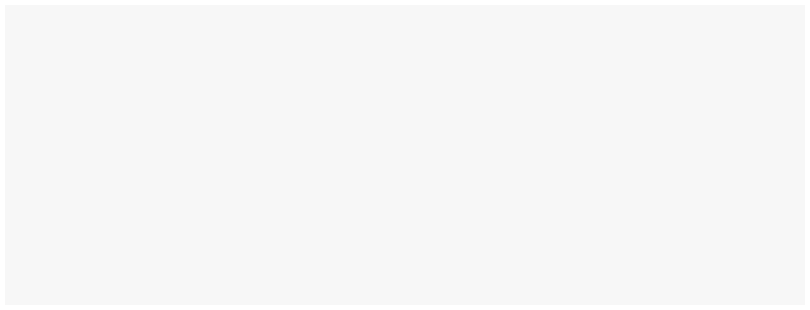

# Load USB

<figure><figcaption>
Add image showing backend view of USB drive directory when seen from desktop and the view of USB contents in the Butter Box portal when inserted into the box.
</figcaption></figure>

There are step-by-step instructions to guide you, depending on what content you’d like to add to your box and how you’d like it to appear.

* [Media, Files and Digital Books](load-usb.md#media-files-and-digital-books)
* [Html Pages](load-usb.md#html-pages)
* [Maps](load-usb.md#maps)
* [Apps](load-usb.md#apps)

##

<figure><figcaption></figcaption></figure>

## Media, Files and Digital Books

If you want to share media, files or digital books, simply drop them onto the USB drive. You can use folders and subfolders to organize your content.

**Things to Know**

* When you have the USB drive plugged in, the 'Explore USB' tile will show up in the portal
* The folder names you use will be displayed in the Butter Box portal

**Instructions**

* Drop individual files in the main directory of your USB drive or use a folder system to organize them.

<figure><figcaption>
Organization of the USB drive - Better caption; update image to only show sample folders (remove appstore, etc)
</figcaption></figure>

<figure><figcaption>
USB contents displayed in butter box portal. - consider using a video instead
</figcaption></figure>

<figure><figcaption></figcaption></figure>

## Html Pages

With html pages, you can create your own experience around the content you're sharing. To display content through a html page, simply add the html file and it's complementary folders to the jump drive.

**Things to Know**

* If a folder contains an html file, the web page will be displayed in the portal when the folder is opened.
* The html page needs to be available offline. That means that everything (media, pages, fonts, etc) need to be locally available and linked.

**Instructions**

If you have one html file in the main directory, the html page will appear when users tap 'Explore USB' from the portal. If you have multiple folders in the directory, the folders will appear when users tap 'Explore USB'. Once they tap into the folder that contains an hmtl file, that webpage will be displayed \[show video demo].

* Drop individual files in the main directory of your USB drive or use a folder system to organize them.

<figure><figcaption>
USB directory when viewed in Finder on desktop
</figcaption></figure>

<figure><figcaption>
Consider showing a video or animated view of tapping into the USB tile to view a website
</figcaption></figure>

<figure><figcaption></figcaption></figure>

## Maps

**Things to Know**

* Offline map support is for Android only

**Instructions**

If you want to share offline map files, you need to provide the latest version of Open Street Map for Android, along with the map files for locations of interest.

* Download OSM map apk for Android: [Free Releases — Android | OsmAndosmand.net](https://osmand.net/docs/versions/free-versions/?current-os=ios&)
* Download OSM map files: [Osmand Local Indexes Listdownload.osmand.net](https://download.osmand.net/list.php)

Put these all in a folder named **osm-map-files**. Place that folder on your Butter Box USB drive.

<figure><figcaption></figcaption></figure>

<figure><figcaption></figcaption></figure>

## Apps

There are 3 different ways to share apps from a Butter Box. We'll provide you with the basic instructions for each.&#x20;

| Method                     | Supported Apps        | Security                                                   | Guidance     |
| -------------------------- | --------------------- | ---------------------------------------------------------- | ------------ |
| F-Droid repo               | Android               | Best                                                       | Most Secure  |
| Static offline website     | Android, iOS, Desktop | Limited (does not offer ease for distributing app updates) | More Curated |
| Files organized in folders | Android, iOS, Desktop | Limited (does not offer ease for distributing app updates) | Easiest      |

**Things to Know**

* You will need to download the app files. Apps are updated frequently. Be sure to manually update all of the app files frequently to ensure you are providing the highest security for the people who connect to the box.
* Be sure to download apps from trusted sources.
* (tbd) The app store tile will show up in your portal if you use the F-Droid repo or a static offline website.
* (tbd) If you're using a static offline website, you will need to develop your own local html page.&#x20;

**Instructions**

* Create a folder called **‘appstore**’. Put it in the main directory on your USB drive. Within that file place your html file with the apk files in the same folder or subfolder. When you insert your USB drive into the Butter Box, the App Store tile will show up in the portal.
* To get an app store tile to show up, you need to put a folder in your USB directory called **appstore**. The folder must contain one of two things:&#x20;
  1. An HTML file that links to APK and other app downloads&#x20;
  2. Or the required F-Droid file. Learn more about creating a F-Droid repo at \_\_\_\_\_\_\_.
* As an alternative, you can simply share apk files directly on the USB the same way you can share media, files and digital books.

<figure><figcaption></figcaption></figure>

\[image of different app displays-tbd]
