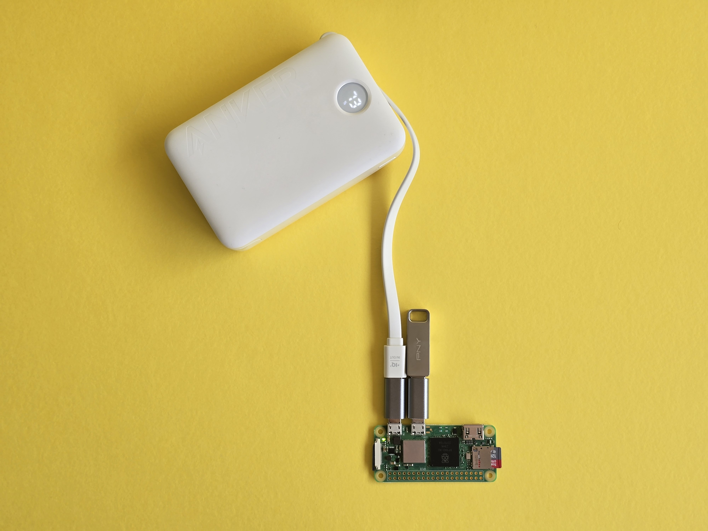
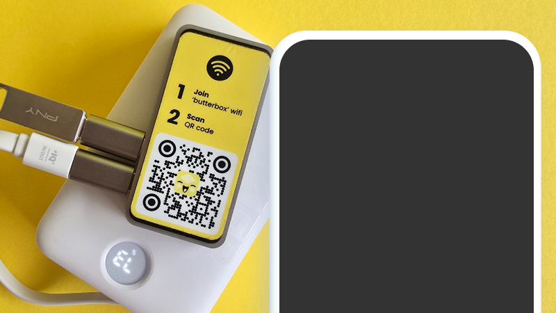

# Power On

If you have a Butter Box with the latest version of the Butter software loaded on the SD card, take these quick steps to get set up.

1. Power On
2. Load USB
3. Set Wifi Password

<figure><figcaption>
Video of plugging in. Use overlay of labels to indicate which supplies (SD card with Butter Box software, power supply, USB drive, adapters as needed)
</figcaption></figure>

<figure><figcaption></figcaption></figure>



### Check supplies

Make sure you have the following supplies:

* Power source
* USB drive
* Device
* Case

<figure><figcaption></figcaption></figure>



### Plug it in to power on

Connect the power supply to the first micro USB port and correct wall outlet.

<figure><figcaption></figcaption></figure>

You will know the box is working if ‘butterbox’ wifi appears in the wifi list. If it doesn’t, unplug the box and plug it back in.

[Link to Power Supply Options](../build-a-box/power-supply.md)

_If using a solar battery or other means of power, use one with the correct specs to ensure adequate power and avoid damage to the unit. For a Pi Zero 2 W use Micro USB power supply with at least 2.0A._




### Insert USB drive

Connect the USB adapter to the open port. Then plug in the USB drive. Learn more about loading the USB drive with treasures in the [Load USB](load-usb.md) section.

<figure><figcaption></figcaption></figure>



### Access the Butter Box Portal

Join the ‘butterbox’ Wi-Fi. After 30 seconds, scan the QR code on the box. This connects you to http://butterbox.lan in a browser.

<figure><figcaption></figcaption></figure>

_If this page does not load, wait a few minutes to ensure connectivity. Refresh the page. If you’re connecting from a smartphone, turn off your mobile data or turn on airplane mode. Then try again._

The Wi-Fi does not have a password by default. Though, you can easily add one. Learn more in the [Set Wi-Fi Password ](set-wifi-password.md)section.



### Once connected, explore the portal!

Explore the portal for yourself! Once you share with others, they will connect to it in the same way you just did.


For a Pi Zero 2 W: Up to 5 people can connect to the box at any time. After people connect and get what they need, encourage them to leave the box to give others a turn.\
The physical reach of the Box varies. But as a rule of thumb, people in the same room as the box (or in talking distance) will be able to access it.





<figure><figcaption>
video of the connect to portal flow
</figcaption></figure>
