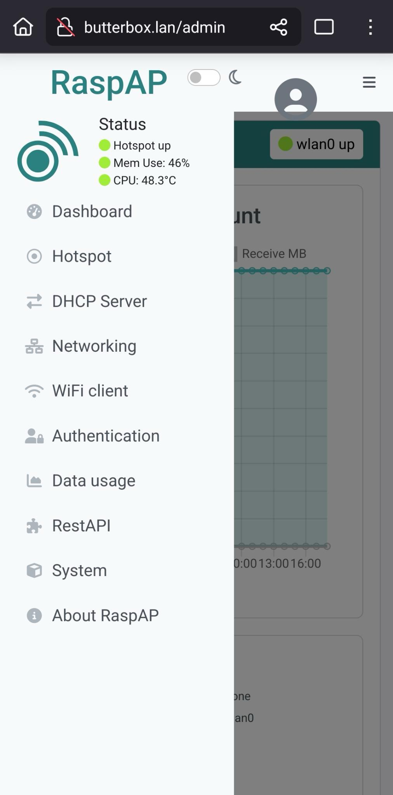
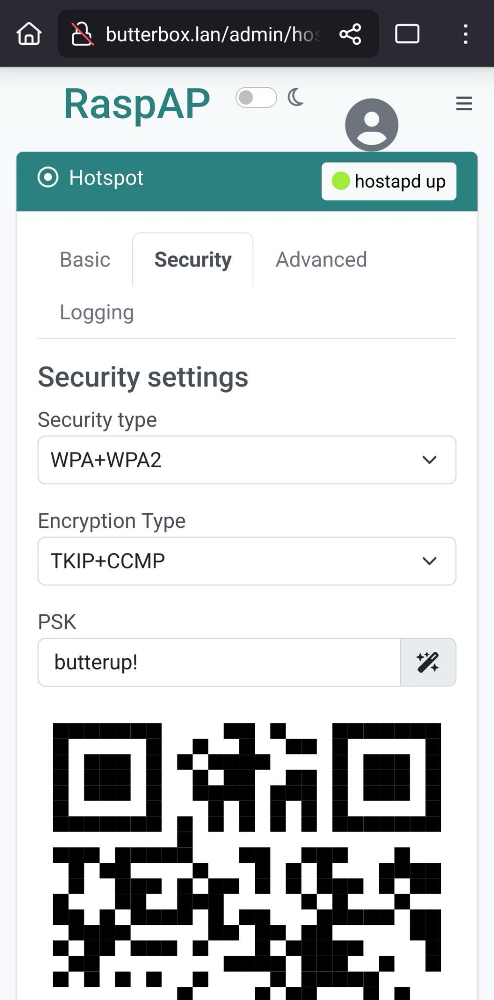
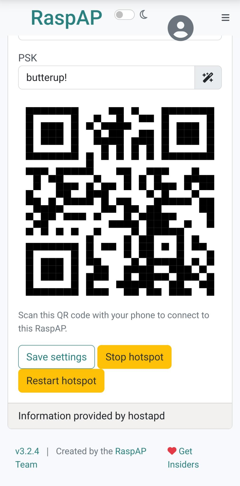

# Set Wifi Password

Changing the Wi-Fi password for your Butter Box hotspot from the admin dashboard is straightforward. Here are the steps:



#### Access the RaspAP Web Interface

Open a web browser on a device connected to your Butter Box and type [http://butterbox.lan/admin](http://butterbox.lan/admin)

<figure><figcaption>
RaspAP admin dashboard for your Butter Box hotspot
</figcaption></figure>



#### Log In

The default credentials are: Username: `admin` | Password: `secret` (It's strongly recommended to change these default admin credentials after initial setup for security).



#### Navigate to Hotspot Settings

On the side panel menu click on the "Hotspot".



#### Go to the Security Tab

Within the Hotspot section, look for the "Security" tab.



#### Change current settings

On the Security tab,&#x20;

* Change "Security Type" for "WAP+WAP2"
* Change "Encryption Type" for "TKIP+CCMP"
* On "PSK" (Pre-Shared Key), enter your desired new Wi-Fi password

Or if you'd like, the "magic icon" next to it can generate a strong password for you. Note: this password is a combination of random number and letters, if you choose this option, make sure to safely save it somewhere.

<figure><figcaption>
Change Security Settings
</figcaption></figure>



#### Save and Restart Hotspot

After entering the new password, scroll down and click the "Save settings" button.&#x20;

You will then need to click on "Restart hotspot" for the changes to take effect. This will temporarily disconnect all devices from the Butter Box as it reconfigures.

<figure><figcaption>
Save settings and then restart your hotspot
</figcaption></figure>



Once the hotspot restarts, you and your friends will need to connect to the Butter Box again using the new Wi-Fi password you just set.


If you change the SSID (network name) or the password, the QR codes found in this documentation and in \
Butter Box kits we distribute will no longer work. You'll need to create a new QR code or have folks type the password to be able to join your network.


