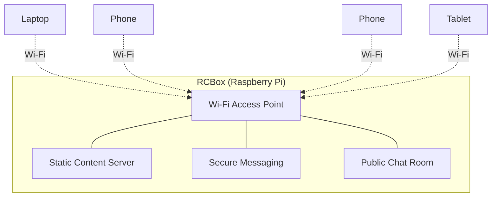
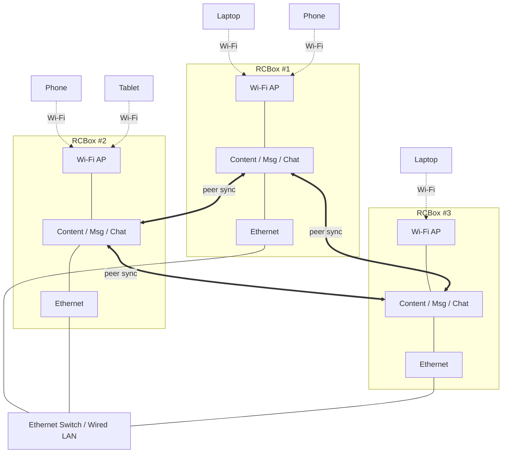
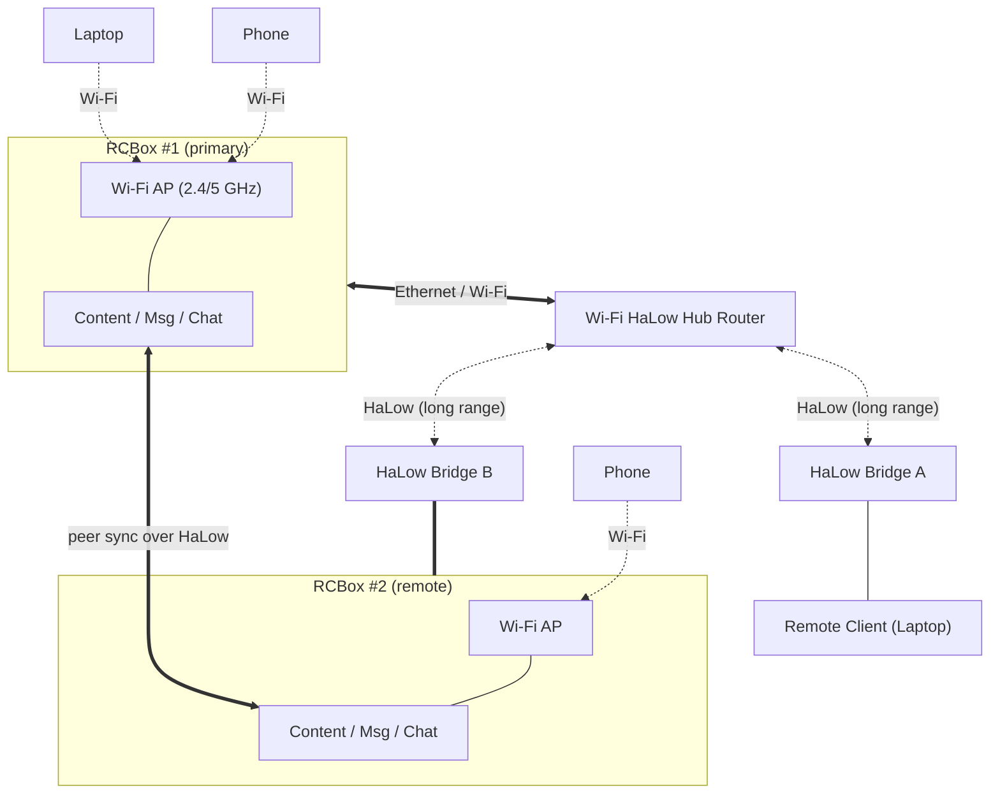
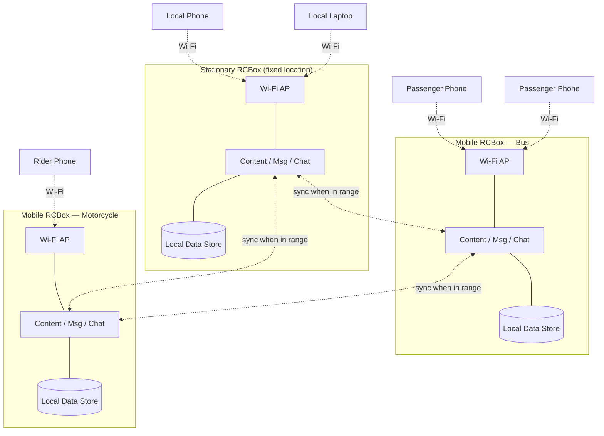

# RCBox Network Topologies

RCBox is a Raspberry Pi–powered micro server and Wi-Fi hotspot that serves
static content offline and hosts secure messaging and public chat.

## 1. Standalone Offline — Direct Wi-Fi Clients

A single RCBox acts as an access point; clients associate directly to its
Wi-Fi radio. No internet, no upstream — fully self-contained.

## 2. Multiple RCBoxes on a Wired LAN

Several RCBoxes are joined by Ethernet and share data peer-to-peer across
the wired backbone. Each RCBox continues to serve its own Wi-Fi clients.

## 3. RCBox with Wi-Fi HaLow Extended Range

An RCBox uplinks to a Wi-Fi HaLow hub router. Remote endpoints reach the
hub via HaLow bridges — one bridging a client device, another bridging a
second RCBox at distance.

## 4. Opportunistic Mobile Mesh

A stationary RCBox anchors a location. Mobile RCBoxes — one mounted in a
bus, another on a motorcycle — carry data as they move, syncing
opportunistically whenever they come within Wi-Fi range of the base or
each other (a store-and-forward "sneakernet over Wi-Fi").

