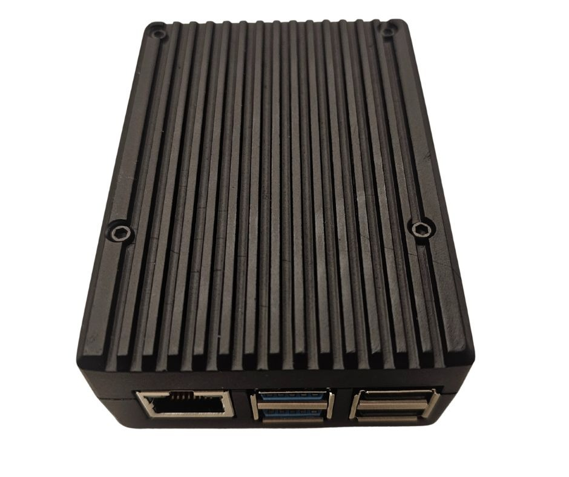

# Безопасность

Это руководство было разработано для развёртывания в опасных средах, где устройства могут быть досмотрены, конфискованы, модифицированы или использованы не по назначению. Оно направлено на предоставление практических рекомендаций по повышению физической и цифровой устойчивости Butter Box к взлому.

Следование рекомендациям в этом руководстве поможет снизить риски, но не гарантирует абсолютную безопасность. Предполагается, что Butter Box — это развёртываемая в полевых условиях, недорогая офлайн-система, поэтому эти рекомендации отдают приоритет реалистичным и доступным мерам защиты.

**Допущения модели угроз**

Прежде чем применять меры контроля, чётко определите контекст вашего развёртывания. Это руководство предполагает один или несколько из следующих рисков:

* Физический доступ неавторизованных пользователей
* Конфискация или досмотр устройства властями
* Злонамеренные действия локальных пользователей
* Манипулирование или подмена контента
* Злоупотребление сетью или выдача себя за другого
* Повторное использование учётных данных или злоупотребление конфигурацией по умолчанию

Помните, что меры контроля должны адаптироваться к локальному уровню риска — чрезмерное укрепление защиты может снизить удобство использования и доверие.

### Раздел 1: Физическая устойчивость к взлому

#### Защита корпуса и оборудования

Физический доступ к Butter Box позволяет клонировать SD-карту, заменить прошивку, внедрить вредоносное ПО и транслировать вредоносную информацию. Печатные платы также хрупкие и должны иметь дополнительную защиту для обеспечения их сохранности при повседневном использовании и воздействии погодных условий.

Рекомендации:

1. Используйте герметичный или полугерметичный корпус (винты вместо защёлок)
2. Предпочтительны винты с защитой от вскрытия (Torx, защитный шестигранник)
3. Наносите индикаторные наклейки на швы корпуса и слоты SD-карт

| 1) Герметичные корпуса             | 2) Винты                                |
| --------------------------------- | --------------------------------------- |
|  | .jpeg>) |

#### 

#### Защита SD-карты и хранилища

Рекомендации:

1. Используйте высококачественные SD-карты для повышения надежности хранения данных
2. Шифруйте чувствительные разделы (где это возможно)
3. Держите контент и ОС раздельно (прошивка и наборы контента)
4. Избегайте названий SD-карт, компрометирующих владельца

Дополнительно (контексты повышенного риска):

1. Эпоксидная смола. Решения для заливки электроники защищают печатные платы от экстремальных температур, влажности, вибрации и других угроз.
2. Физическая блокировка извлечения SD-карты

| Эпоксидная смола                        | Эпоксидная смола                        |
| --------------------------------------- | --------------------------------------- |
| .jpeg>) | .jpeg>) |

#### .jpeg>)

#### Управление питанием и портами

Рекомендации:

1. Отключите или физически заблокируйте неиспользуемые порты (USB, HDMI). Недорогие физические блокираторы портов могут использоваться для снижения риска взлома Butter Box путём предотвращения несанкционированного доступа к открытым интерфейсам. Эти блокираторы ограничивают возможность злоумышленников внедрять вредоносный код, подключать несанкционированные периферийные устройства или транслировать нежелательный контент. Порты запечатываются пластиковыми блокираторами, которые можно снять только с помощью специального ключа, входящего в комплект развёртывания.
2. Избегайте открытия Ethernet-портов, если это не требуется. Ethernet-порты должны оставаться отключёнными или физически заблокированными, если они явно не требуются для развёртывания. Когда доступ через Ethernet необходим, его использование должно быть чётко задокументировано и ограничено доверенными операторами.
3. Используйте короткие внутренние кабели для усложнения обнаружения
4. Избегайте индентифицирующих маркировок (имена, названия организаций)

| USB и HDMI                              | Ethernet-порты                          |
| --------------------------------------- | --------------------------------------- |
| .jpeg>) | .jpeg>) |

#### Эксплуатационные практики

Рекомендации:

* Храните устройства в надежном месте, когда они не используются
  #TODO:ask guardian project
* Периодически заменяйте устройства при длительном развёртывании
* Предполагайте, что устройства могут быть скопированы или утеряны
* Относитесь к Butter Box как к полуодноразовой инфраструктуре, а не как к персональным устройствам. 

### Раздел 2: Цифровая устойчивость к взлому

#### Гигиена учётных данных (Критически важно)

Обязательные действия:

SSH

* По умолчанию пользователь pi имеет пароль butterbox-admin.
* Измените этот пароль, подключившись к pi через ssh и выполнив passwd.
* Если вы предпочитаете использовать SSH-ключ, обязательно отключите доступ по паролю после включения доступа на основе ключей.

RaspAP

* Точка доступа имеет административный интерфейс, который можно использовать для изменения её настроек.
* По умолчанию: пользователь: admin, пароль: secret (по иронии, это не секрет).
#TODO:ask guradian project why we need spanish url
* Измените доступы, войдя на[ http://butterbox.lan/admin](http://butterbox.lan/admin) (или[ http://comolamantequilla.lan/admin](http://comolamantequilla.lan/admin) для Box на испанском языке) и используя веб-интерфейс.

Чат

* Локальный чат был создан административным пользователем butterbox-admin. Пароль для этого пользователя также butterbox-admin.
* Измените этот пароль, войдя в Butter Box, перейдя в публичную комнату чата, затем посетив свой профиль пользователя и обновив пароль. По вашему усмотрению вы также можете изменить имя с butterbox-admin, чтобы другие пользователи вас узнавали.

Лучшие практики:

* Используйте уникальные пароли для каждого развёртывания
* Храните учётные данные оффлайн в защищённом виде
* Никогда не используйте учётные данные повторно в разных регионах

#### Повышение информационной безопасности
Рекомендации:

* Отключите сервисы, которые не являются строго необходимыми:
* SSH (или ограничьте доступ по ключам)
* Bluetooth
* USB-порты

#### Целостность и подлинность контента

Рекомендации:

* Поддерживайте неизменность прошивки во время нормальной работы
* Храните резервную копию установочного образа системы
* Периодически перепрошивайте устройства при длительном развёртывании

Операционный контроль:

* Только доверенные операторы должны устанавливать или обновлять контент
* Документируйте источники обновлений и даты

### Раздел 3: Предотвращение злоупотреблений

#### Злоупотребления в локальном чате и контенте

Риски:

* Преследование или язык ненависти
* Выдача себя за другого
* Распространение дезинформации

Меры противодействия:

* Чёткие правила использования, отображаемые локально
* Роли модераторов сообщества (при необходимости)
* Возможность быстрого сброса или очистки данных чата
* Ограничение того, кто может загружать или заменять контент
* Режим только для чтения для большинства пользователей

### Раздел 4: Реагирование на инциденты и восстановление

Превентивные меры:

* Предполагайте, что некоторые устройства будут взломаны
* Поддерживайте простую процедуру очистки и перепрошивки
* Отслеживайте развёртывания

