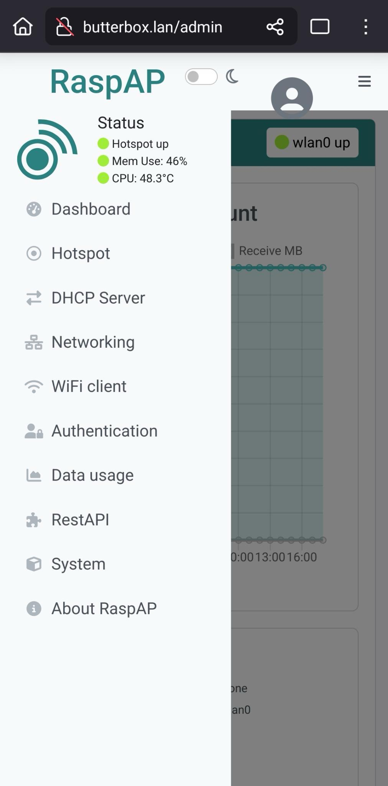
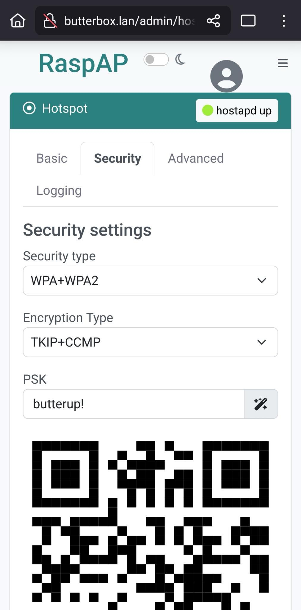

# Security

### How to add a password to the Wi-Fi network

By default, the network will be named `butterbox` and will have no password to it. You can change this using the RaspAP admin interface available at [http://butterbox.lan/admin](http://butterbox.lan/admin)

By adding a password to the network so only those you give the password to can join. Consider if this is right for your use case.

***

Changing the Wi-Fi password for your Butter Box hotspot from the admin dashboard is straightforward. Here are the steps:



#### Access the RaspAP Web Interface

Open a web browser on a device connected to your Butter Box and type [http://butterbox.lan/admin](http://butterbox.lan/admin)

<figure><figcaption>
RaspAP admin dashboard for your Butter Box hotspot
</figcaption></figure>



#### Log In

The default credentials are: Username: `admin` | Password: `secret` (It's strongly recommended to change these default admin credentials after initial setup for security).



#### Navigate to Hotspot Settings

On the side panel menu click on the "Hotspot".



#### Go to the Security Tab

Within the Hotspot section, look for the "Security" tab.



#### Change current settings

On the Security tab,&#x20;

* Change "Security Type" for "WAP+WAP2"
* Change "Encryption Type" for "TKIP+CCMP"
* On "PSK" (Pre-Shared Key), enter your desired new Wi-Fi password

Or if you'd like, the "magic icon" next to it can generate a strong password for you. Note: this password is a combination of random number and letters, if you choose this option, make sure to safely save it somewhere.

<figure><figcaption>
Change Security Settings
</figcaption></figure>



#### Save and Restart Hotspot

After entering the new password, scroll down and click the "Save settings" button.&#x20;

You will then need to click on "Restart hotspot" for the changes to take effect. This will temporarily disconnect all devices from the Butter Box as it reconfigures.

<figure><figcaption>
Save settings and then restart your hotspot
</figcaption></figure>



Once the hotspot restarts, you and your friends will need to connect to the Butter Box again using the new Wi-Fi password you just set.


If you change the SSID (network name) or the password, the QR codes found in this documentation and in \
Butter Box kits we distribute will no longer work. You'll need to create a new QR code or have folks type the password to be able to join your network.


### How to change RaspAP default password

The default credentials are to access the RaspAP web interface are: Username: `admin` | Password: `secret`&#x20;

It's strongly recommended to change these default admin credentials after initial setup for security.



#### Access the RaspAP Web Interface

Open a web browser on a device connected to your Butter Box and type [http://butterbox.lan/admin](http://butterbox.lan/admin)

<figure><figcaption>
RaspAP admin dashboard for your Butter Box hotspot
</figcaption></figure>



#### Navigate to Authentication Settings

On the side panel menu click on the "Authentication".



#### Change current settings

From there, you can change the default RaspAP web interface password and keep your Butter Box more secure.

<figure><figcaption>
Change default password
</figcaption></figure>



### Other Security Highlights

* **Offline by design** — No internet connection means no exposure to online tracking, hacking, or remote attacks.
* **Local-only data** — All apps, message board, and content are stored and shared within the local network; nothing leaves unless a user downloads it.
* **Password-protected chatrooms** — Private message boards require a password, preventing unauthorized access to group conversations.
* **Open-source transparency** — Code is fully visible and modifiable, allowing security audits and custom hardening.
* **Control over physical access** — The owner decides where and when the device is powered on and available.

### Limitations

* **Open Wi-Fi by default** — Anyone nearby can join the network unless you manually set a Wi-Fi password.
* **Local network visibility** — Once connected, users can see the Butter portal if they know the IP address or have the QR code.
* **No user accounts or permissions** — Content is available to all connected users; there’s no built-in way to hide specific files from certain people.
* **No HTTPS encryption** — Pages are served over HTTP since it’s offline; there’s no secure certificate system, though traffic stays within the local network.
* **Physical access equals control** — Anyone who gets hold of the device or SD card can access and copy its stored content.

The Butter Box images we distributed have a standard set of passwords. Because these are shared publicly, they are not secure. You should change the passwords to prevent unauthorized access to your Butter Box. For more information, visit our Gitlab documentation: [https://gitlab.com/likebutter/butterbox-rpi/-/blob/main/docs/en/README.md](https://gitlab.com/likebutter/butterbox-rpi/-/blob/main/docs/en/README.md)

