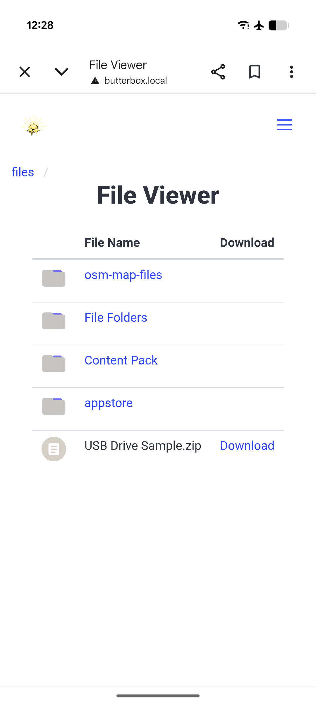
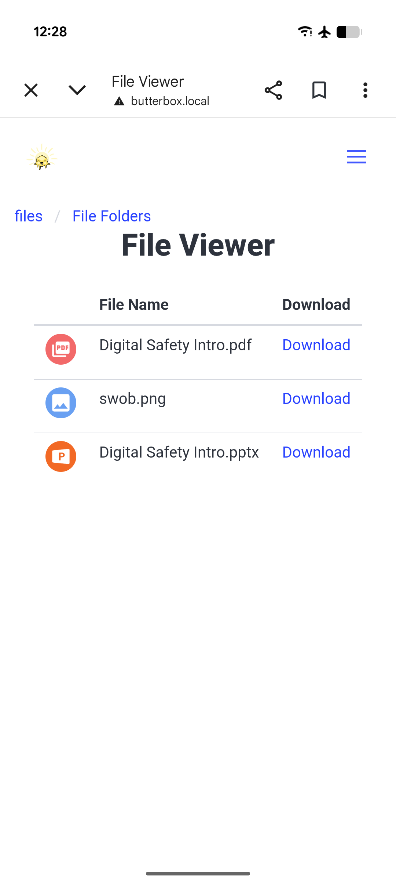

# File Sharing

<figure><figcaption></figcaption></figure>

## Share Media, Files and Digital Books

You can use your Butter Box to share media, files, and digital books. To display additional content in your portal, connect a USB drive containing the information you want to share.

If you’d like more control over how your content is displayed, you can build a **static website** and share it through the Butter Box. Learn more in the [Content Packs](../content-packs/) section.



### Add files to your USB Drive

Place individual files directly in the **main directory** (root) of your USB drive. Or, create folders to organize your files (eg. "Books", "Music", "Reports)

<figure><figcaption>
USB directory when viewed in Finder on desktop
</figcaption></figure>

**Things to Know**

* The **folder names you use** on your USB drive will be shown in the Butter Box portal.
* Organizing content into folders makes it easier for others to browse and download.



### Connect to your Butter Box to view

Insert the USB drive into your Butter Box. After connecting your USB drive to the Raspberry Pi you will see the **Files** tile displayed when you open the Butter Box portal.

<figure><figcaption></figcaption></figure> <figure><figcaption></figcaption></figure>

**Troubleshooting**

If you don’t see the **Files** tile, try the following actions:

* Remove the USB drive from the Butter Box. Then re-insert the USB drive.
* Turn on/off airplane mode. Reconnect Butter Box wifi.
* Refresh the browser page.

If you are still having trouble you may need to [Reformat Your USB Drive](../faq/how-to-reformat-your-usb-drive.md).

