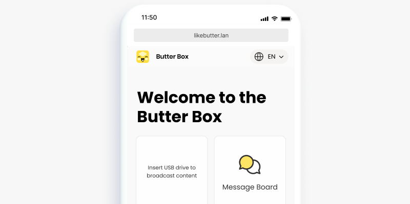
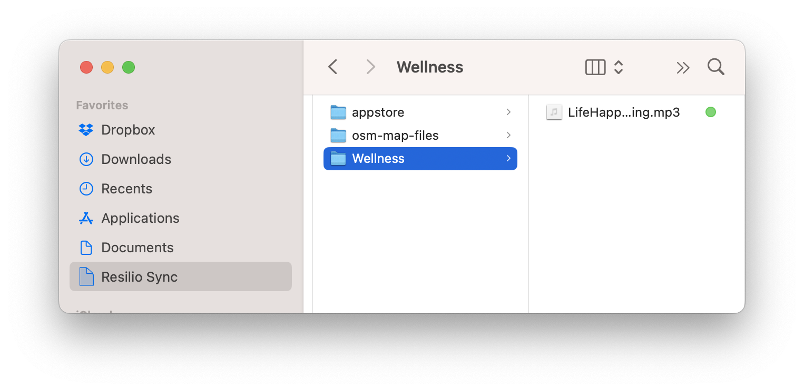
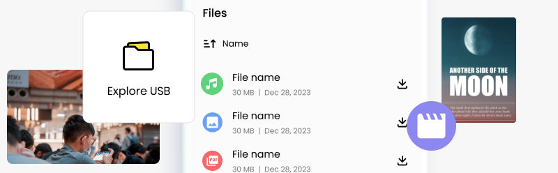

# Обмен файлами

## Делитесь медиа, файлами и электронными книгами

Вы можете использовать свой Butter Box для обмена медиафайлами, файлами и электронными книгами. Чтобы отобразить дополнительный контент на вашем портале, подключите USB-накопитель с информацией, которой вы хотите поделиться.

Если вы хотите больше контроля над тем, как отображается ваш контент, вы можете создать **статический сайт** и распространять его через Butter Box. Узнайте больше в разделе [Наборы контента](../content-packs/).

### Добавьте файлы на USB-накопитель

Разместите отдельные файлы непосредственно в **главной директории** (корне) вашего USB-накопителя. Или создайте папки для организации файлов (например, «Книги», «Музыка», «Отчёты»)

**Полезная информация**

* **Имена папок**, которые вы используете на USB-накопителе, будут отображаться на портале Butter Box.
* Организация контента в папки облегчает другим пользователям просмотр и скачивание.

---

### Подключитесь к Butter Box для просмотра

Вставьте USB-накопитель в Butter Box. После подключения USB-накопителя к Raspberry Pi вы увидите плитку **Файлы** при открытии портала Butter Box.

**Устранение неполадок**

Если вы не видите плитку **Файлы**, попробуйте следующие действия:

* Извлеките USB-накопитель из Butter Box. Затем снова вставьте USB-накопитель.
* Включите/выключите режим полёта. Повторно подключитесь к Wi-Fi Butter Box.
* Обновите страницу браузера.

Если у вас всё ещё возникают проблемы, возможно, вам нужно [переформатировать USB-накопитель](../faq/how-to-reformat-your-usb-drive.md).

