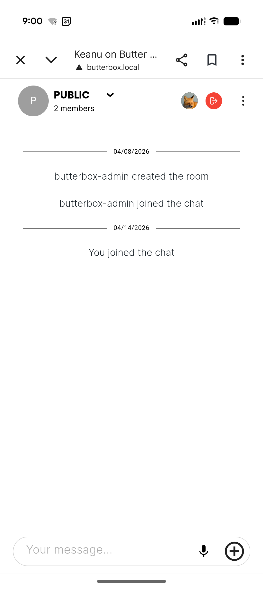
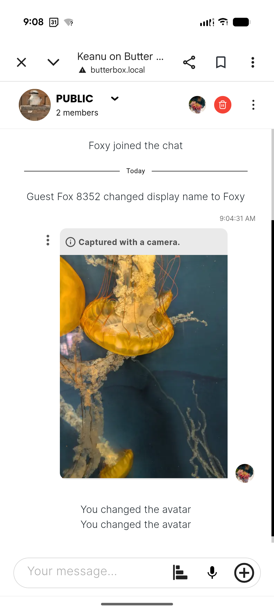
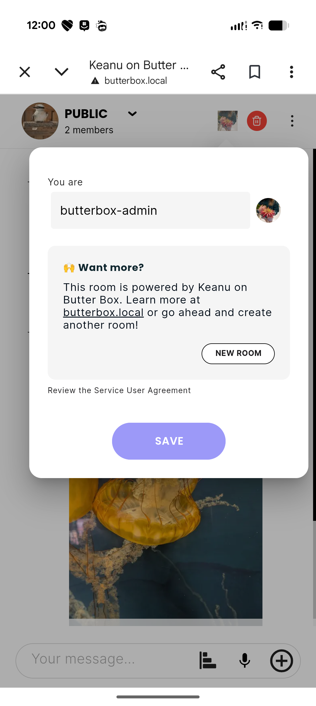
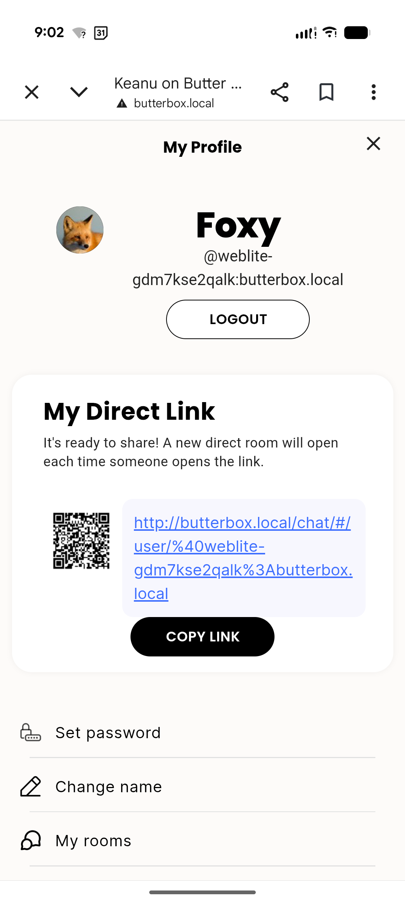
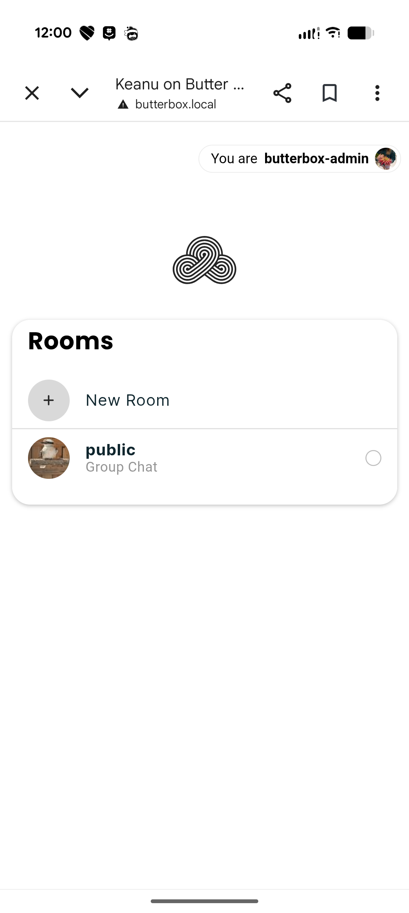
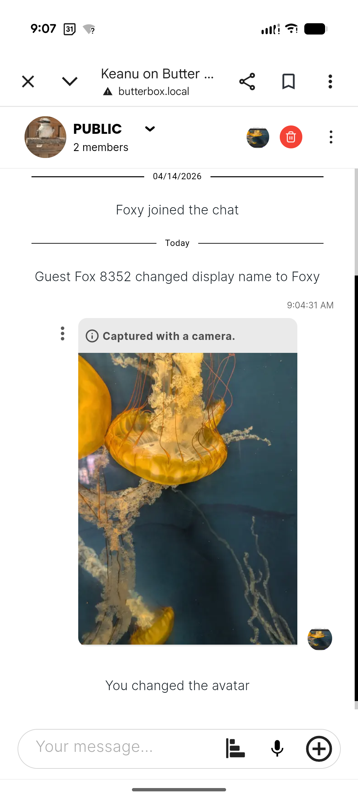
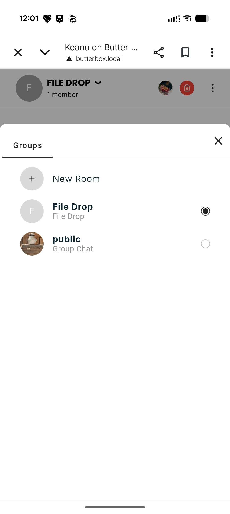

# Local Chat

There is one local chat on your Butter Box that is open to anyone who is able to join the box. If they can open the portal, they can open the chat and say or post anything they want. Depending on your use case, moderation capabilities may be important.&#x20;

First, let's look at what you can and can't do with this local chat.




✅  **You Can** 

* Host videos up to 5 GB PDFs, images, record, audio messages, share pre-recorded audio messages or music&#x20;
* Download the full chat or any individual piece of content or media that people have shared




❌  **You Cannot** 

* Use the chat to talk with people who are not connected to the Butter Box
* Get notifications when there are new posts or messages&#x20;
* See the messages unless you are connected to the Butter Box



| 

 | 

 |
| ------------------------------------------------------------------------------------------------------- | ------------------------------------------------------------------------------------------------------- |

## Moderation

A Butter Box offers moderation features for the local chat. In order to access these features, you need to login as the admin of the room.

### Become the Admin



### Logout as Guest

When you open the local chat, you are assigned a guest identity. First logout of the account that was created for you.



### Login as Admin

Login to the `butterbox-admin` account. Username and password are both  `butterbox-admin`.



### Change Admin Password

Visit your user profile to change the password. At your discretion, you may also wish to change your display name so that other users will recognize you.



### Moderation Features

Once you are an admin, you have access to the following features:

* **Set a message timer**
* **Delete messages**
* **Promote members to moderator or admin**
* **Kick members out.**&#x20;
  * Keep in mind that someone can simply rejoin as a new guest if they reconnect to the box
* **Delete the room.**&#x20;
  * Warning: If you delete the room, you will no longer have a local chat on your Butter Box. To get one back, you will have to flash a new image of the Butter Box software to your SD card.

## Say Even More—Direct Messages and Private Rooms

In addition to the local chat, you can create any number of private rooms from the same interface.

### Things To Know

* Each room will have it's own QR code.&#x20;
* Private rooms are not discoverable from the Butter Box portal.
* If you create a private room, you have to share the QR code physically to whomever you want to join **who is also connected to the box.**
* Every private chat that you are part of, will be easy for **you** to find. They will all show up in your room list.

### Instructions

You can create a private room from two different places in the message board interface.



### Open from Avatar Modal

Tap on your avatar in the top bar. Select **new room.**

|  | 

 |
| ----------------------------------------------------------------------------------------- | ----------------------------------------------------------------------------------------------------------- |




### Open from Room List

Your room list is accessible from your profile page. Once here, select **My Rooms.**

|  | 

 |
| ----------------------------------------------------------------------------------------- | ------------------------------------------------------------------------------------------------------- |



### Open from Drop-down

Your room list is accessible from the drop-down arrow next to the room name.

| 

 | 

 |
| ------------------------------------------------------------------------------------------------------- | -------------------------------------------------------------------------------------------------------------- |



