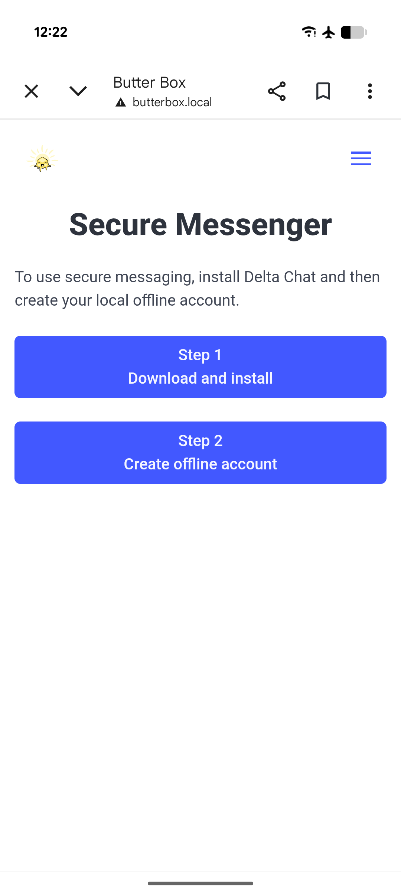
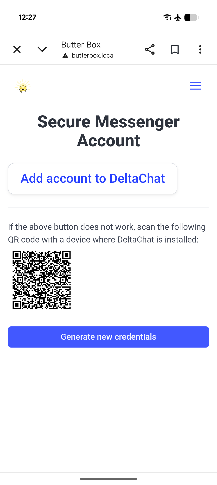

# Secure Messenger

With the Private Messenger service, you can exchange secure messages with people you know. [Delta Chat](https://delta.chat/) is a messaging app that uses email protocols to exchange messages. When used through a Butter Box, people who create accounts on the same Butter Box can send messages to each other without the internet.

Think of the Butter Box like a local post office. Whenever you connect to the Box’s network, your Delta Chat app can send outgoing messages and sync to receive any new ones waiting for you.

| 

 | 

 |
| ------------------------------------------------------------------------------------------------------- | ------------------------------------------------------------------------------------------------------- |

