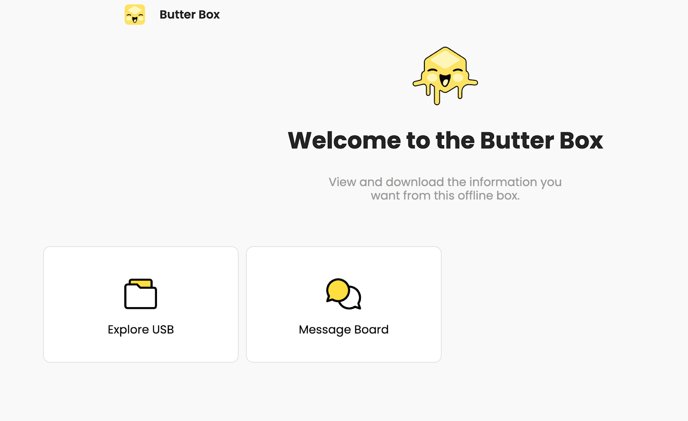

# Issues with File Sharing

After connecting your USB drive to the Raspberry Pi you will see the “Explore USB” title displayed on the portal.

 

If you’ve tried refreshing your portal page and still do not see the “Explore USB” tile then you may need to erase your USB stick and reformat it.&#x20;

When you format a USB drive, all files and folders on the drive are removed and replaced with a new file system. This can help repair any issues with the flash drive itself or make it compatible with new files you want to transfer. Be sure to back up your files before formatting your drive.  

**Check the Format of the USB**

* On your desktop or laptop, plug in your USB&#x20;
* Right, or double-click on the USB
* Click on “Get info” and verify the Format
* Your USB needs to be formatted to ExFat or Fat32, MS-DOS (FAT).

**Reformatting Steps on MacOS:**

* Connect the USB drive to a USB port on your computer.
* Right, or double-click on the USB
* Click on “Erase Disk…”&#x20;
* You can rename your USB at this time
* Select the correct format, either ExFat or ExFat32 or MS-DOS (FAT)
* Then tap “Erase”
* A message may appear warning you that all content will be deleted. Select “Erase”
* This may take a few minutes. The USB will disappear and reappear on your homescreen
* Verify the drive is correctly formatted
* Right, or double-click on the USB
* Click on “Get info” and verify the Format 

**Reformatting Steps on Windows:**

* Connect the USB drive to a USB port on your computer.
* Open the File Explorer and select "This PC" from the menu.
* You can find this option in the left panel, next to a monitor icon.[\[2\]](https://www.wikihow.com/Format-a-Flash-Drive#_note-2)
* On Windows 7, click Computer on the right side of the Start window.
* Right-click the flash drive's icon. It's beneath the "Devices and drives" heading in the middle of the page. This will bring up a drop-down menu.
* Choose "Format". This will open the formatting window.
* Click on "File System" and choose the MS-DOS, FAT32, or exFAT format.
* [FAT32](https://www.wikihow.com/Format-FAT32) - The most widely compatible format. Works with most computers and gaming consoles.
* exFAT - Similar to FAT32, but designed for external hard drives (e.g., flash drives) and quicker use. It's a universal format that is most common across Windows, Linux, and Mac.
* Select "Start" and click "OK" to finish formatting your flash drive.
* A final prompt will appear, Click “OK”. Your flash drive has successfully been formatted. 

.png>).png>).png>)

.png>)

.png>)

 
